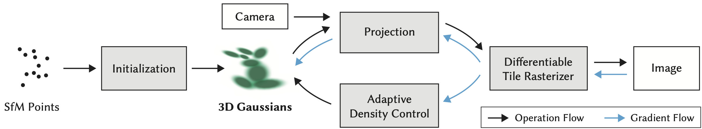
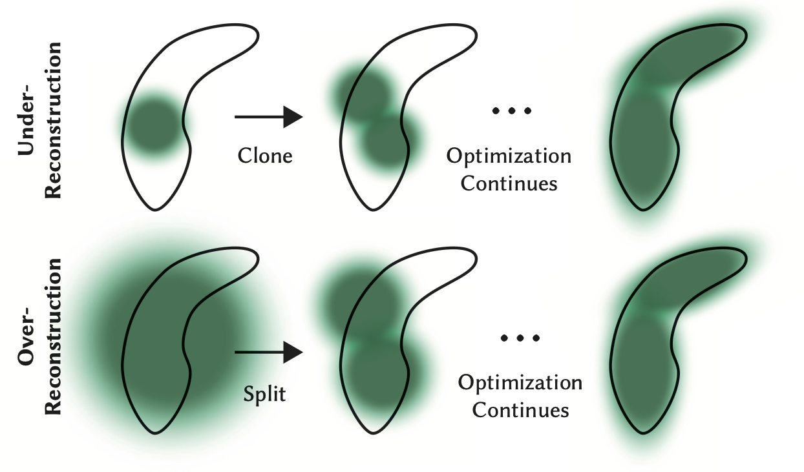

# 3D Gaussian Splatting for Real-Time Radiance Field Rendering

## OSS

Developed a real-time novel-view synthesis radiance field rendering algorithm.

## TAGs

#TOG #Y2023 #rendering #novel_view_synthesis #radiance_fields

## Methods

### NeRFs vs Points (3D Gaussian Splatting)

- NeRFs are a continuous representation implicitly representing  empty/occupied space; expensive random sampling is required to find the samples in Eq. 2 with consequent noise and computational expense.
    - $`C = \sum^{N}_{i=1} T_i \alpha_i c_i`$
- In contrast, points are an unstructured, discrete representation that is flexible enough to allow creation, destruction, and displacement of geometry similar to NeRF.

### Overview

- The input to our method is a set of images of a static scene, together with the corresponding cameras calibrated by SfM which produces a sparse point cloud as a side effect.
- From these points we create a set of 3D Gaussians, defined by a position (mean), covariance matrix and opacity 𝛼, that allows a very flexible optimization regime. This results in a reasonably compact representation of the 3D scene, in part because highly anisotropic volumetric splats can be used to represent fine structures compactly.
- Our algorithm proceeds to create the radiance field representation via a sequence of optimization steps of 3D Gaussian parameters, i.e., position, covariance, 𝛼 and SH coefficients interleaved with operations for adaptive control of the Gaussian density.
- **The optimization is based on successive iterations of rendering and comparing the resulting image to the training views in the captured dataset.**

### Adaptive Control of Gaussians

We start with the initial set of sparse points from **SfM** and then apply our method to adaptively control the number of Gaussians and their density over unit volume1, allowing us to go from an initial sparse set of Gaussians to a denser set that better represents the scene, and with correct parameters.

## Resources

- [📜 ARXIV: The papr](https://arxiv.org/abs/2308.04079)
- [📜 ACM: The paper](https://dl.acm.org/doi/10.1145/3592433)
- [📺 3D Gaussian Splatting for Real-Time Radiance Field Rendering](https://youtu.be/T_kXY43VZnk)
- [🌏 Project page](https://repo-sam.inria.fr/fungraph/3d-gaussian-splatting/)
- [🌏 Official implementation](https://github.com/graphdeco-inria/gaussian-splatting)
- [📺 Getting Started With 3D Gaussian Splatting for Windows](https://youtu.be/UXtuigy_wYc)
- [🌏 🤗 Introduction to 3D Gaussian Splatting](https://huggingface.co/blog/gaussian-splatting)
