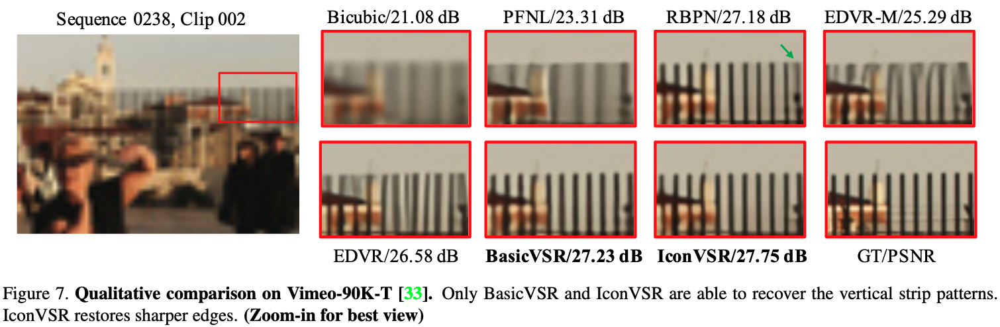
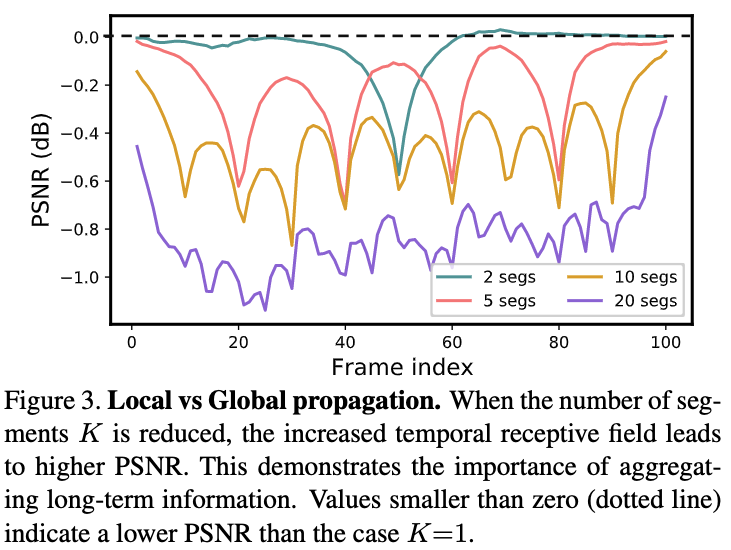
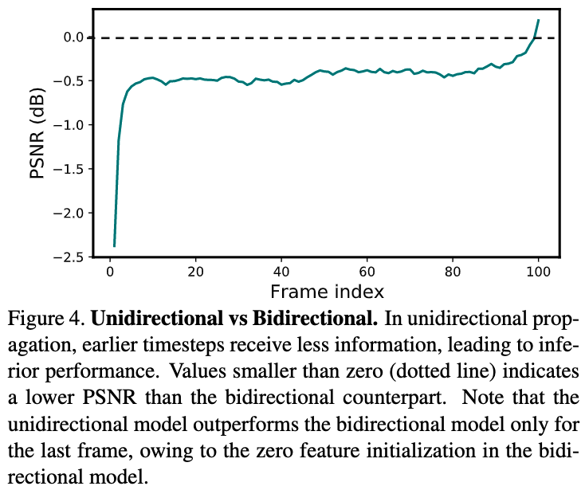
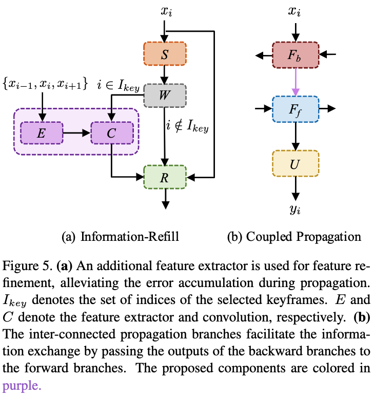

# BasicVSR: The Search for Essential Components in Video Super-Resolution and Beyond

## OSS

Proposed a baseline framework and improvements on long video sequences.

## TAGs

#CVPR #Y2021 #video_super_resolution

## Methods

### BasicVSR

- Propagation. It specifies how the information in a video sequence is leveraged.
    - **Local Propagation**. The sliding-window methods take the LR images within a local window as inputs and employ the local information for restoration.
        - The omittance of distant frames inevitably limits the potential of the sliding-window methods.
        - 
        - ❗️The difference in PSNR is reduced (i.e. better performance) when the number of segments decrease. This suggests that the information in distant frames is beneficial to the restoration and should not be neglected.
        - ❗️The difference in PSNR is the largest at the two ends of each segment, indicating the necessity of adopting long sequences to accumulate long-term information.
    - **Unidirectional Propagation**. The information is sequentially propagated from the first frame to the last frame.
        - 
        - ❗️The unidirectional model obtains a significantly lower PSNR than bidirectional propagation at early timesteps, and the difference gradually reduces as more information is aggregated with the increase in the number of frames.
        - One can improve the output quality by propagating information back from the last frame of the sequence.
    - **Bidirectional Propagation**. The above two problems can be simultaneously addressed by bidirectional propagation, in which the features are propagated forward and backward in time independently.
- Alignment. It is responsible to align highly related but mis-aligned images/features for subsequent aggregation.
    - **Without Alignment**. It is pivotal to adopt operations that have a large enough receptive field to aggregate information from distant spatial locations.
    - **Image Alignment**. Resulting from the inaccuracy of optical flow estimation, the warped images inevitably suffer from blurriness and incorrectness.
    - **Feature Alignment**.
- Aggregation and Upsampling. BasicVSR adopts basic components for aggregation and upsampling.

### IconVSR

Use BasicVSR as a backbone. To mitigate error accumulation during propagation and to facilitate information aggregation.

- **Information-Refill**.
    - Inaccurate alignment in occluded regions and on image boundaries is a prominent challenge that can lead to error accumulation, especially if we adopt long-term propagation in our framework.
    - The feature extractor and feature fusion are applied to the sparsely-selected keyframes only. Hence, the computational burden brought by the information-refill mechanism is insignificant.
    - It is trained with a fixed keyframe interval.
- **Coupled Propagation**.
    - In bidirectional settings, features are typically propagated in two opposite directions independently. In this design, the features in each propagation branch are computed based on partial information, from either previous frames or future frames.

## Resources

- [CVF: the paper](https://openaccess.thecvf.com/content/CVPR2021/papers/Chan_BasicVSR_The_Search_for_Essential_Components_in_Video_Super-Resolution_and_CVPR_2021_paper.pdf)
- [ARXIV: the paper](https://arxiv.org/abs/2012.02181)
- [GitHub: official implementation](https://github.com/open-mmlab/mmagic/blob/master/configs/restorers/basicvsr/README.md)
