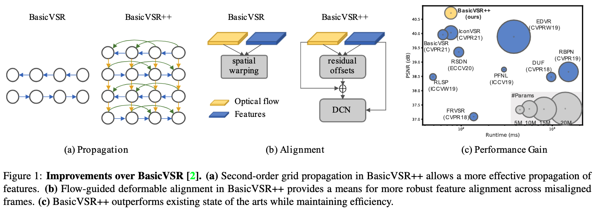
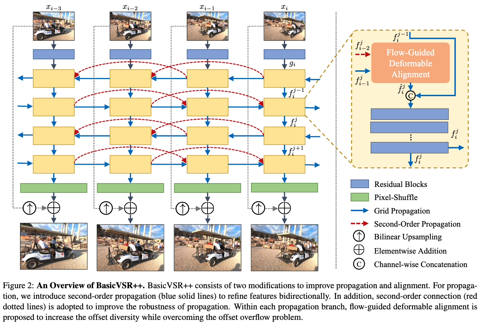
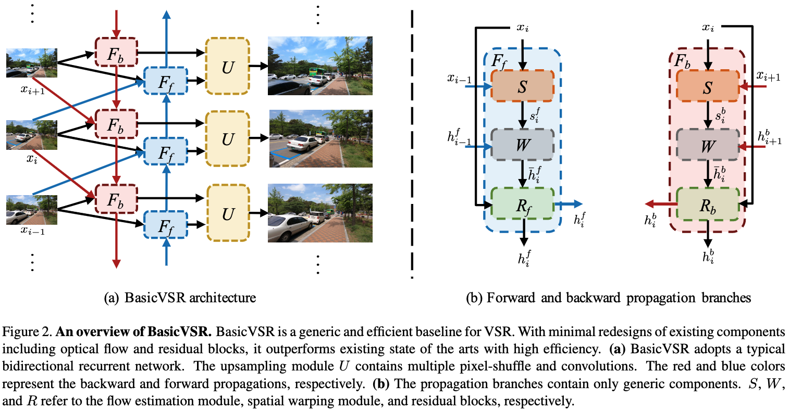
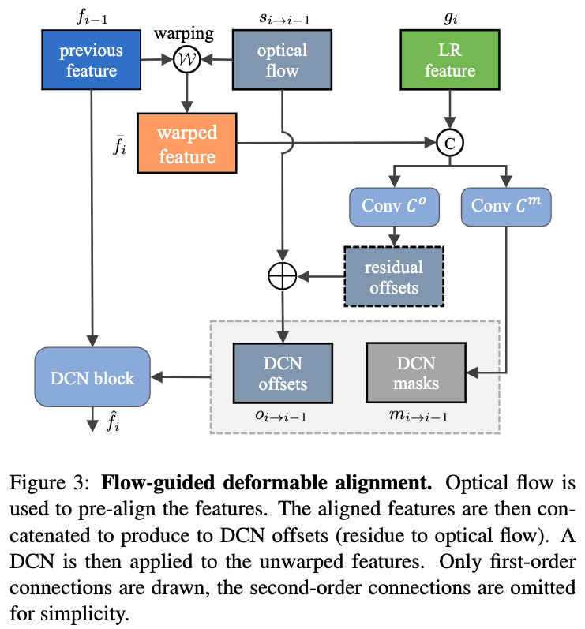

# BasicVSR++: Improving Video Super-Resolution with Enhanced Propagation and Alignment

## OSS

Redesigned BasicVSR with second-order grid propagation and flow-guided deformable alignment for video super-resolution.

## TAGs

#CVPR #Y2022 #video_super_resolution

## Methods

### Second-Order Grid Propagation

- Compared to existing works that propagate features only once, grid propagation repeatedly extracts information from the entire sequence, improving feature expressiveness.
- $`\hat{f}_i^j = \mathcal{A} (g_i, f_{i-1}^j, f_{i-2}^j, s_{i \rightarrow i-1}, s_{i \rightarrow i-2})`$
- $`f_i^j = \hat{f}_i^j + \mathcal{R} ( \mathcal {c} ( f_i^{j-1}, \hat{f}_i^j ))`$
    - $`f_i^0 = g_i`$
    - $`\mathcal {A}`$ : flow-guided deformable alignment
    - $`\mathcal {R}`$ : residual blocks
    - $`\mathcal {c}`$ : concatenation

### Flow-Guided Deformable Alignment

- To align one single feature:
    - $`\bar{f}_{i-1} = \mathcal{W} ( f_{i-1}, s_{i \rightarrow i-1})`$
    - $`o_{i \rightarrow i-1} = s_{i \rightarrow i-1} + \mathcal{C}^o ( \mathcal{c} (g_i, \bar{f}_{i-1}) )`$
    - $`m_{i \rightarrow i-1} = \sigma ( \mathcal{C}^m ( \mathcal{c}(g_i, \bar{f}_{i-1}) ) )`$
    - $`\hat{f}_i = \mathcal{D} (f_{i-1}; o_{i \rightarrow i-1}, m_{i \rightarrow i-1})`$
    - $`\mathcal{W}`$ : spatial warping operation
    - $`\mathcal{C}^o`$ : a stack of convolution for DCN offsets
    - $`\mathcal{C}^m`$ : a stack of convolution for DCN masks
    - $`\mathcal{D}`$ : a deformable convolutionn
- To align two features (second-order propagation), for computation efficiency:
    - $`o_{i \rightarrow i-p} = s_{i \rightarrow i-p} + \mathcal{C}^o ( \mathcal{c} (g_i, \bar{f}_{i-1}, \bar{f}_{i-2}) )`$
        - $`p = 1,2`$
    - $`m_{i \rightarrow i-p} = \sigma ( \mathcal{C}^m ( \mathcal{c}(g_i, \bar{f}_{i-1}, \bar{f}_{i-2}) ) )`$
        - $`p = 1,2`$
    - $`o_i = \mathcal{c} ( o_{i \rightarrow i-1}, o_{i \rightarrow i-2})`$
    - $`m_i = \mathcal{c} ( m_{i \rightarrow i-1}, m_{i \rightarrow i-2})`$
    - $`\hat{f}_i = \mathcal{D} ( \mathcal{c} (f_{i-1}, f_{i-2}); o_i, m_i )`$
- Benefits
    - CNNs are known to have local receptive fields, the learning of offsets can be assisted by pre-aligning the features using optical flow.
    - By learning only the residue, the network needs to learn only small deviations from the optical flow, reducing the burden in typical deformable alignment modules.
    - Instead of directly concatenating the warped feature, the modulation masks in DCN act as attention maps to weigh the contributions of different pixels, providing additional flexibility.

## Resources

- [CVF: the paper](https://openaccess.thecvf.com/content/CVPR2022/papers/Chan_BasicVSR_Improving_Video_Super-Resolution_With_Enhanced_Propagation_and_Alignment_CVPR_2022_paper.pdf)
- [ARXIV: the paper](https://arxiv.org/abs/2104.13371)
- [Project page](https://ckkelvinchan.github.io/projects/BasicVSR++/)
- [GitHub: Official implementation](https://github.com/ckkelvinchan/BasicVSR_PlusPlus)
- [YouTube: BasicVSR++: Improving Video Super-Resolution with Enhanced Propagation and Alignment](https://youtu.be/iIDml09CUc4?si=8kjoddsZdnGzUOVB)
