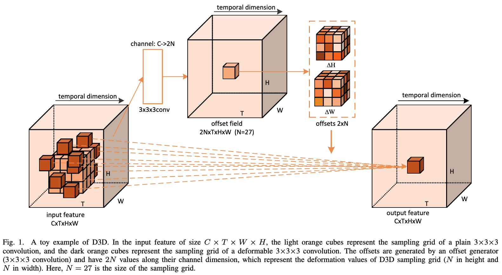
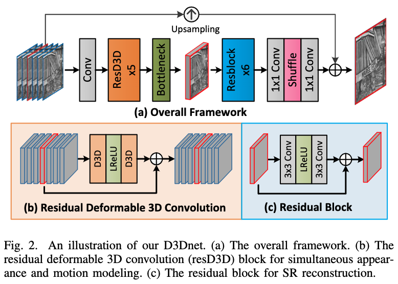

# Deformable 3D Convolution for Video Super-Resolution

## OSS

Proposed deformable 3D convolution block (without alignment) for video super resolution.

## TAGs

#SPL #Y2020 #video_super_resolution

## Methods

## Resources

- [ARXIV: the paper](https://arxiv.org/abs/2004.02803)
- [GitHub: official implementation](https://github.com/XinyiYing/D3Dnet)
- [Demo video](https://wyqdatabase.s3-us-west-1.amazonaws.com/D3Dnet.mp4)
