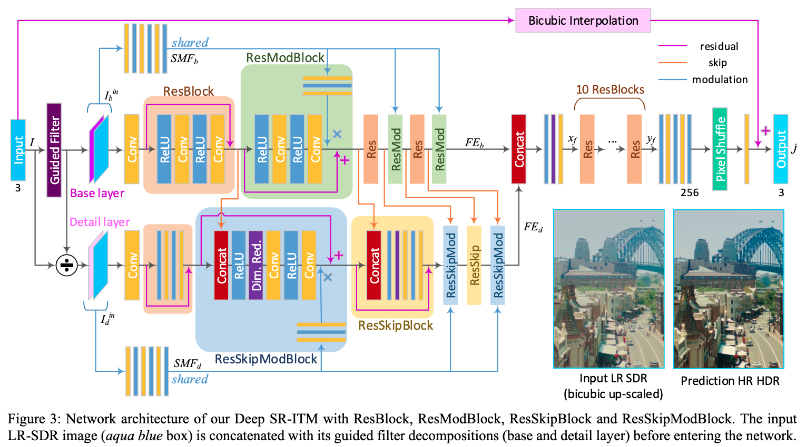

# Deep SR-ITM: Joint Learning of Super-Resolution and Inverse Tone-Mapping for 4K UHD HDR Applications

## OSS

Joint learning of super-resolution and inverse tone-mapping for 4k UHD HDR applications.

## TAGs

#ICCV #Y2019 #high_dynamic_range_video #video_super_resolution

## Methods

- Before entering the network, the input LR SDR image $`I`$ is decomposed into the base layer $`I_b`$ and the detail layer $`I_d`$ using the guided filter (an edge-preserving low-pass filter).
    - [Guided Image Filtering](https://ieeexplore.ieee.org/document/6319316)
    - $`I_b`$ is computed by applying the guided filter to $`I`$, and then $`I_d`$ is obtained by simply dividing $`I`$ by $`I_b`$
    - $`I_d = I \oslash I_b`$
    - $`I_b`$ contains a blurred color image, dominant with low frequency information.
    - $`I_d`$ is mostly colorless, dominant with high frequency information.
- Our method takes 5.85 seconds and 5.05 seconds to generate a 4K frame for SF = 2 (scale factor) and SF=4, respectively, on an VIDIA TITAN Xp GPU.
- 👨🏼‍🦲 no temporal consistency?
- We collected ten 4K-UHD HDR videos (BT.2020 with PQ-OETF) of 59,818 frames in total from YouTube.

## Resources

- [CVF: the paper](https://openaccess.thecvf.com/content_ICCV_2019/papers/Kim_Deep_SR-ITM_Joint_Learning_of_Super-Resolution_and_Inverse_Tone-Mapping_for_ICCV_2019_paper.pdf)
- [ARXIV: the paper](https://arxiv.org/abs/1904.11176)
- [GitHub: official repository](https://github.com/sooyekim/Deep-SR-ITM)
