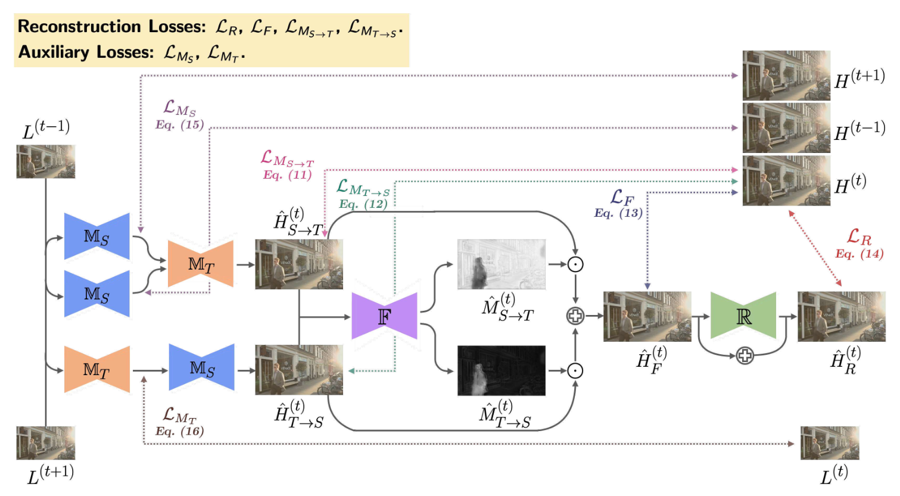
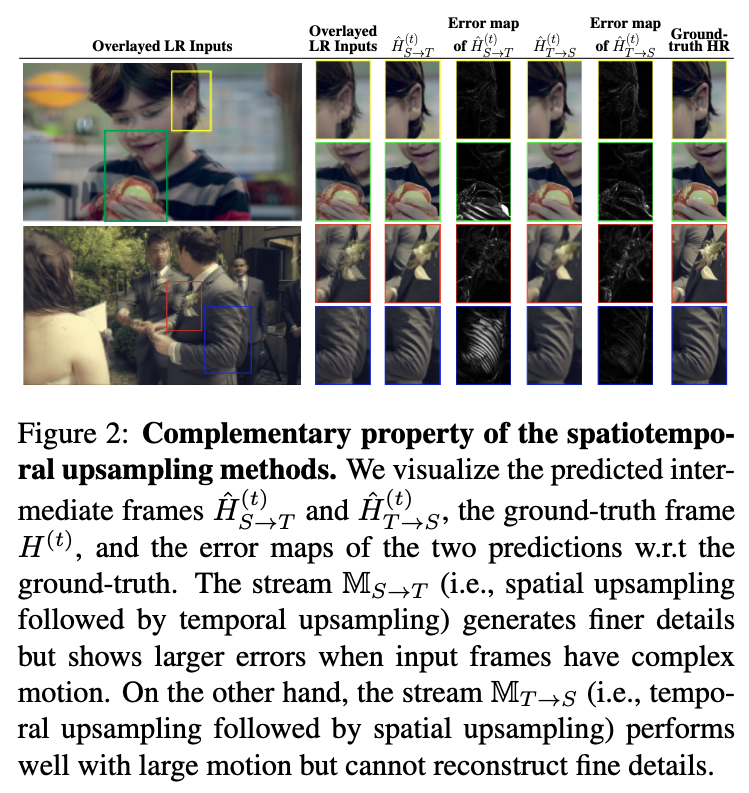

# Dual-Stream Fusion Network for Spatiotemporal Video Super-Resolution

## OSS

Proposed a framework of fusing Spatio-Temporal-VSR & Temporal-Spatio-VSR streams.

## TAGs

#WACV #Y2021 #video_super_resolution #video_frame_interpolation

## Methods

### Join Spatio-Temporal-VSR & Temporal-Spatio-VSR stream

### Complementary property of the spatiotemporal upsampling methods

Spatio → Temporal: finer details, larger errors when input frames have complex motion.

## Resources

- [CVF: The paper](https://openaccess.thecvf.com/content/WACV2021/papers/Tseng_Dual-Stream_Fusion_Network_for_Spatiotemporal_Video_Super-Resolution_WACV_2021_paper.pdf)
- [GitHub: Official implementation](https://github.com/TMYuan/Dual-Stream-Fusion-Network)
- [Official introduction video](https://people.cs.nctu.edu.tw/~walon/publications/tseng2021wacv_video.mp4)
- [YouTube: Oral](https://youtu.be/Bvi5ChnGpJE?si=1R0xP71IXBXmoAvb)
