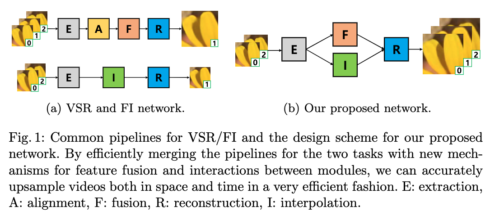
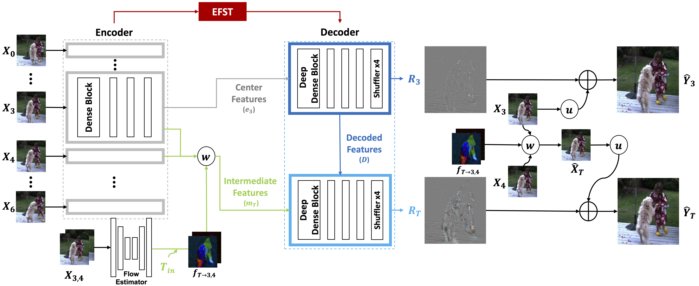
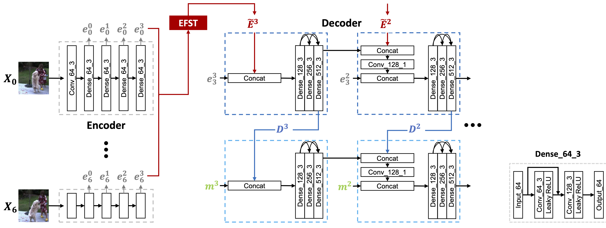
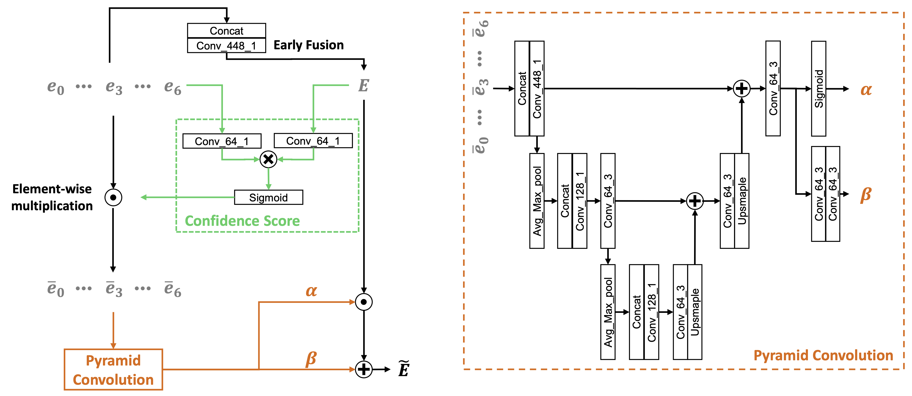

# Deep Space-Time Video Upsampling Networks

## OSS

Proposed a model which fuse spatio-temporal features for spatio-temporal video super resolution.

## TAGs

#ECCV #Y2020 #video_super_resolution #video_frame_interpolation

## Methods

Our framework takes 7 LR frames as inputs, for example $`X_{[0,1,2,3,4,5,6]}`$. Then, it produces the HR frames for the center frame $`\hat{Y}_3`$ as well as __N__ HR intermediate frames $`\hat{Y}_T`$, where $`T \in [3, 4]`$.

### Encoder

U-Net like.

### Early Fusion with Spatio-Temporal weights (EFST)

Early fused features $`E^i`$ are defined as  $`Conv( Concat([e_0^i,...,e_6^i]) )`$ where __Conv__ reduces the channel dimension by the factor of 7 with an **1x1 convolution filter**.

### Intermediate Feature Interpolation

- Super SloMo: High quality estimation of multiple intermediate frames for video interpolation
    - $`f_{T \to 3} = -(1 - T_{in}) T_{in} f_{3 \to 4} + T_{in}^2 f_{4 \to 3}`$
    - $`f_{T \to 4} = (1 - T_{in})^2 f_{3 \to 4} - T_{in} (1 - T_{in}) f_{4 \to 3}`$
    - $`T_{in}`$ : a relative scalar, weight
- $`m_T^i = \frac{ \omega (X_3, f_{T \to 3}) + \omega (X_4, f_{T \to 4}) }{2}`$
    - features of the intermediate frame
- $`\hat{X}_T = \frac{ \omega (X_3, f_{T \to 3}) + \omega (X_4, f_{T \to 4}) }{2}`$
    - LR intermediate frames
    - 👨🏼‍🦲 This part is critical ... since the base image is purely interpolated by optical flow interpolation.

## Resources

- [ARXIV: The paper](https://arxiv.org/abs/2004.02432)
- [GitHub: Official implementation](https://github.com/JaeYeonKang/STVUN-Pytorch)
- [YouTube: Demo](https://youtu.be/ZQoGbN16zKk)
