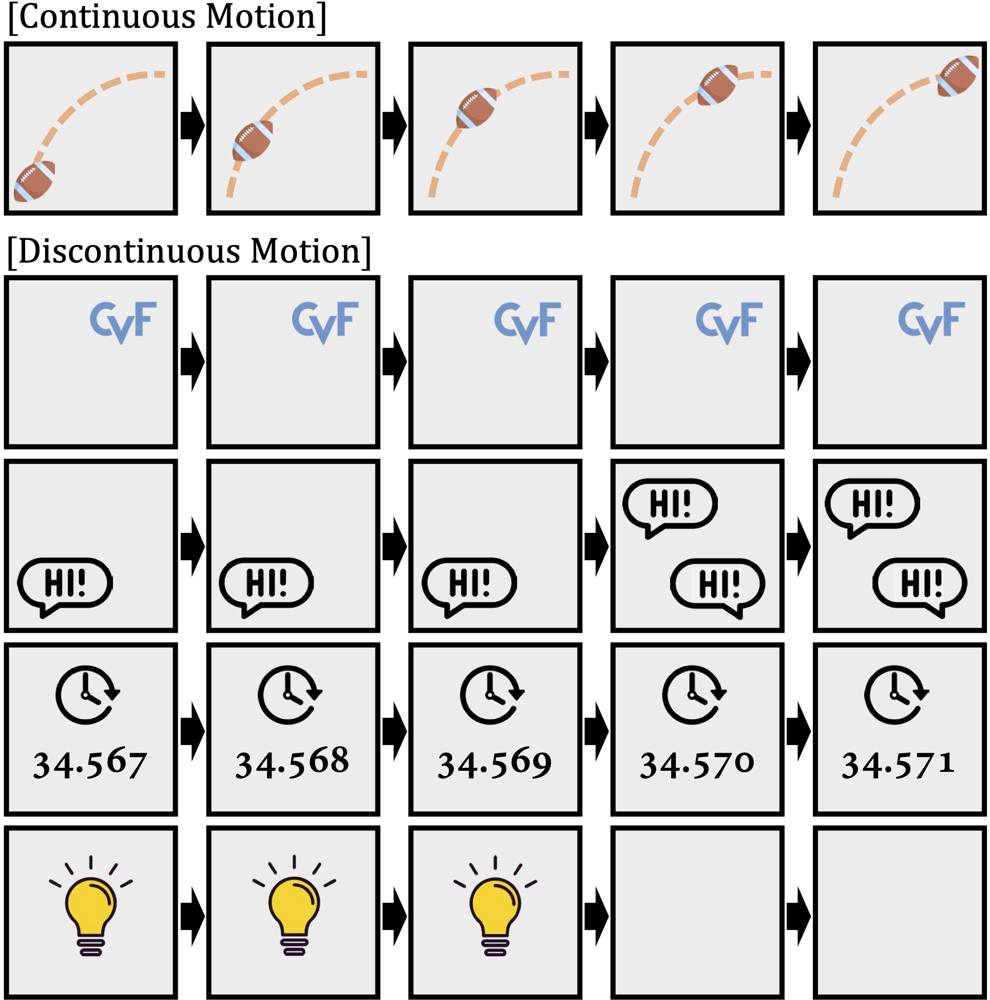
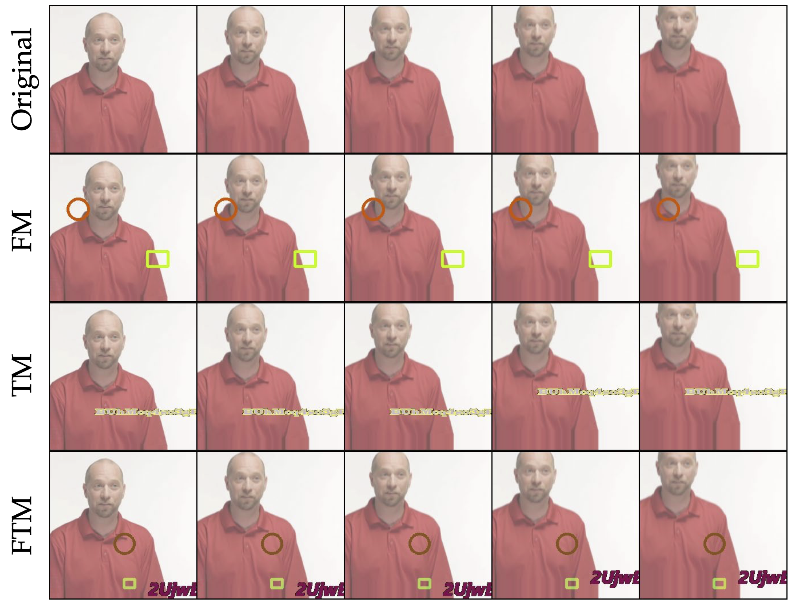

# Exploring Discontinuity for Video Frame Interpolation

## OSS

Proposed 3 techniques for improving deep learning based VFI architectures on discontinuous motions.

## TAGs

#CVPR #Y2023 #video_frame_interpolation

## Methods

These (previous) studies have been conducted on **natural videos containing only continuous motions**. However, many practical videos contain various **unnatural objects with discontinuous motions** such as logos, user interfaces and subtitles.

### Different types of discontinuous motion

- Static texts.
- Instantly moving texts (like texts within messenger, no intermediate frame).
- Changing texts.
- Instantly disappeared objects (or flash lights?).

### Technique 1: New Data Augmentation Strategy: Figure-Text Mixing (FTM)

Add static or dynamic figure (FM) / text (TM) to the training data.

### Technique 2: Discontinuity Map (__D__-map)

- Estimates __D__-map, copy discontinuous objects instead of interpolate them.
- $`\hat{I}_c = \mathcal{F}(I_1, I_2)`$
- $`\hat{I}(\mathbf{x}) = \hat{I}_c(\mathbf{x}) \cdot (1 - D(\mathbf{x})) + I_1(\mathbf{x}) \cdot D(\mathbf{x})`$
- $`D \in (0, 1)^{H \times W \times 1}`$

### Technique 3: Discontinuity map Supervision

- When both FTM and __D__-map are applied in training stage, the ground truth of __D__-map $`D_{gt}`$ can be obtained by simply getting the areas of added figures and texts.
- $`\mathcal{L} = || D - D_{gt} ||`$

## Resources

- [ARXIV: The paper](https://arxiv.org/abs/2202.07291)
- [CVF: The paper](https://openaccess.thecvf.com/content/CVPR2023/html/Lee_Exploring_Discontinuity_for_Video_Frame_Interpolation_CVPR_2023_paper.html)
- [GitHub: Official implementation](https://github.com/pandatimo/Exploring-Discontinuity-for-VFI)
