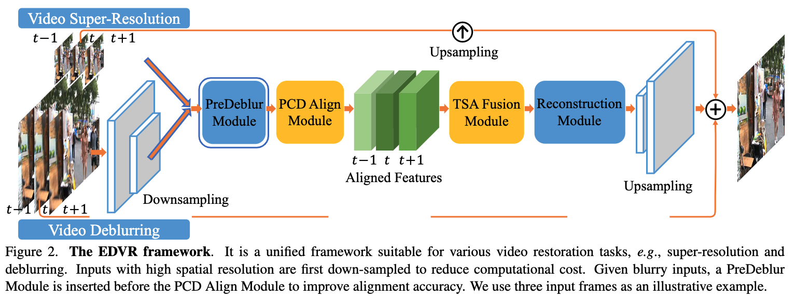
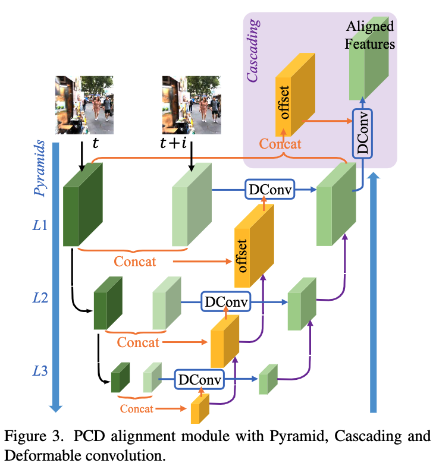
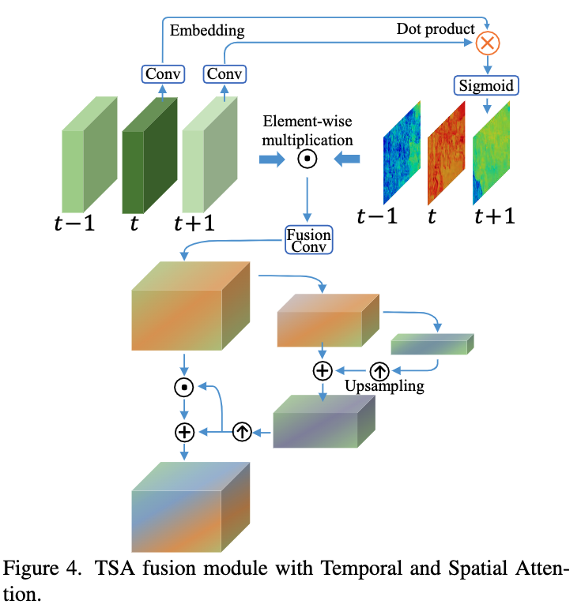

# EDVR: Video Restoration with Enhanced Deformable Convolutional Networks

## OSS

Proposed a model with pyramid, cascading, deformable alignment and temporal-spatial-attention for video restoration.

## TAGs

#CVPRW #Y2019 #video_super_resolution

## Methods

🏆 EDVR won the champions and outperforms the second place by a large margin in all four tracks in the NTIRE19 video restoration and enhancement challenges.

### PreDeblur module

A PreDeblur module is used before the alignment module to pre-process blurry inputs and improve alignment accuracy. A replaceable module. the paper puts no detail on this module.

### Alignment with Pyramid, Cascading and Deformable convolutions (PCD)

- To address complex motions and large parallax problems in alignment, we propose PCD module based on well-established principles in optical flow.
- [Official implementation](https://github.com/xinntao/EDVR/blob/master/basicsr/models/archs/edvr_arch.py)
- 

### Fusion with Temporal and Spatial Attention (TSA)

- Inter-frame temporal relation and intra-frame spatial relation are critical in fusion because
    - different neighboring frames are not equally informative due to occlusion, blurry regions and parallax problems.
    - misalignment and un-alignment arising from the preceding alignment stage adversely affect the subsequent reconstruction performance.
- We propose TSA fusion module to assign pixel-level aggregation weights on each frame. Specially, we adopt temporal and spatial attentions during the fusion process.

### Two-Stage Restoration

- A similar but shallower EDVR network is cascaded to refine the output frames of the first stage.
    - It effectively removes the severe motion blur that can not be handled in the preceding model, improving the restoration quality.
    - It alleviates the inconsistency among output frames.

## Resources

- [Project page](https://xinntao.github.io/projects/EDVR)
- [ARXIV: the paper](https://arxiv.org/abs/1905.02716)
- [CVF: the paper](https://openaccess.thecvf.com/content_CVPRW_2019/papers/NTIRE/Wang_EDVR_Video_Restoration_With_Enhanced_Deformable_Convolutional_Networks_CVPRW_2019_paper.pdf)
- [GitHub: Official implementation](https://github.com/xinntao/EDVR)
