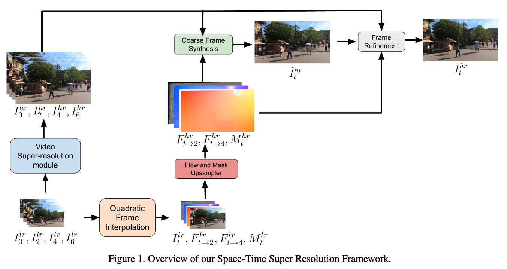
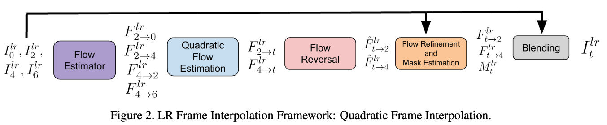
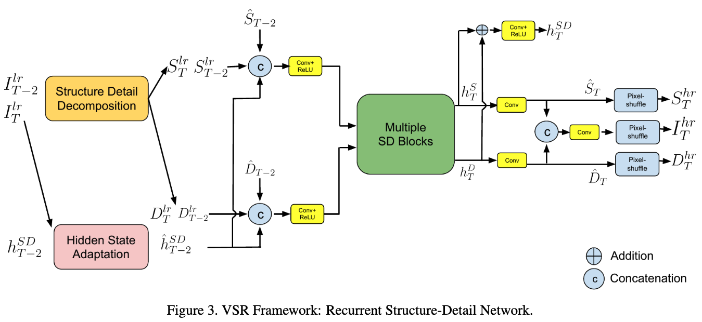

# Efficient Space-time Video Super Resolution using Low-Resolution Flow and Mask Upsampling

## OSS

Proposed a multi-module network to do video super resolution and frame interpolation jointly.

## TAGs

#CVPRW #Y2021 #video_super_resolution #video_frame_interpolation

## Methods

❗️ $`2 < t < 4`$

### LR Frame Interpolation

- PWCNet is used as flow estimator.
- **QFI (Quadratic Frame Interpolation)** uses 4 frames to model non-linear motion.
- Flow reversal layer.
- We use Gradient as flow refinement module.
- We use a 3-layer network to generate blending mask $`M_t^{lr}`$ which helps us in blending warped frames to generate the intermediate frame.

### HR Frame Reconstruction

- We use a video super resolution method, Recurrent Structure Detail Network (RSDN) for generating $`\{ I_0^{hr}, I_2^{hr}, I_4^{hr}, I_6^{hr} \}`$ from corresponding LR frames $`\{ I_0^{lr}, I_2^{lr}, I_4^{lr}, I_6^{lr} \}`$.
- RSDN is a recurrent neural network, which works on Structure and Detail components on input frames rather than the whole frames.
- The **Structure component** captures low-frequency information.
- The **Detail component** captures high-frequency information.

### HR Intermediate Frame Reconstruction

- Solving video frame interpolation in HR space is computationally expensive mostly because of Flow estimation module inside our VFI framework.
- We reuse intermediate flow maps and mask from LR space in this work.
- We upscale LR intermediate flow map and blending mask with the help of bilinear interpolation.
- Use Gradient to refine the coarse frame $`\hat{I}_t^{hr}`$.

### Loss

- $`\mathcal{L} = \alpha_{fr} \mathcal{L}_{fr} + \alpha_{sd} \mathcal{L}_{sd}`$
- Frame Reconstruction loss. Charbonnier loss. $`\mathcal{L}_{fr} = \sum_{i \in \{0, 2, t, 4, 6\}} \mathcal{L}_c(I_i^{hr}, I_i^{hr, gt}) + 0.5 \times \mathcal{L}_c(I_t^{lr}, I_t^{lr, gt})`$
- Structure-Detail loss. Charbonnier loss. Refer to "Video super-resolution with recurrent structure-detail network"
    - $`\mathcal{L}_{sd} = \sum_{i \in \{0, 2, t, 4, 6\}} \mathcal{L}_c (S_i^{hr}, S_i^{hr, gt}) + \sum_{i \in \{0, 2, t, 4, 6\}} \mathcal{L}_c (D_i^{hr}, D_i^{hr, gt})`$

## Resources

- [CVF: the paper](https://openaccess.thecvf.com/content/CVPR2021W/NTIRE/papers/Dutta_Efficient_Space-Time_Video_Super_Resolution_Using_Low-Resolution_Flow_and_Mask_CVPRW_2021_paper.pdf)
- [ARXIV: the paper](https://arxiv.org/abs/2104.05778)
