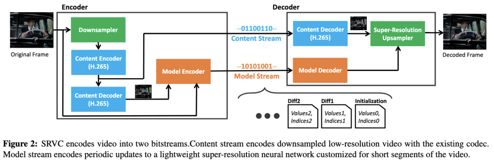
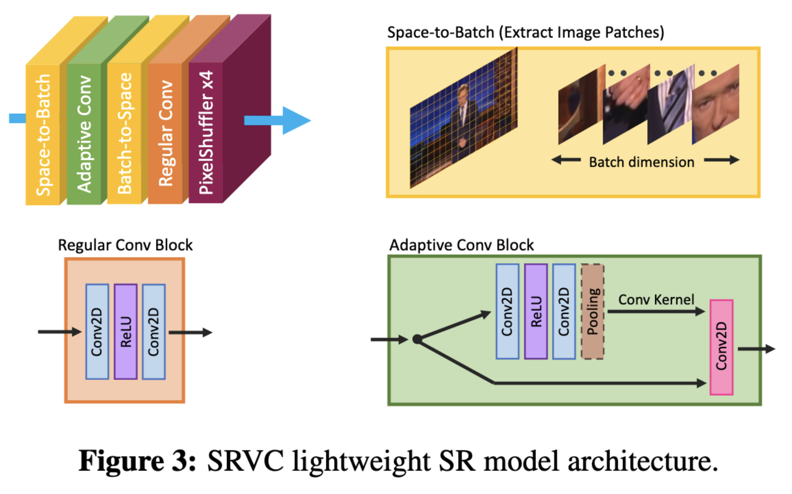

# Efficient Video Compression via Content-Adaptive Super-Resolution

## OSS

Augments existing codecs with small content-adaptive super-resolution models.

## Methods

### Dual-stream

- The standard video compression method (e.g. H.265)
    - Use a content encoder (the blue blocks) to encode the original video frames.
    - Use a content decoder (the blue blocks) to decode the encoded video frames.
- The proposed video compression method
    - Content stream (the blue stream)
        - Use a content encoder (the blue blocks) to encode __downscaled__ video frames (the green blocks) with a standard codec.
    - Model stream (the orange stream)
        - Use __super resolution__ models (the green blocks) to restore __decoded-downscaled__ video frames (the blue blocks).

### Spatially Adaptive Kernels

1. __Space-to-Batch__. Splits a frame into multiple patches (then they are independent).
2. __Adaptive Convolution__. For each patch, uses a network to predict convolution kernel weights, then uses the weights to do convolutions.
3. __Batch-to-Space__. Concatenates all patches. Now each patch has its own features.
4. __Regular Convolution__. Convolves the features
5. __Pixel Shuffle__.

### Model Weights Compression

See the white blocks (initialization, Diff1, Diff2, ...).

1. Splits video frames to $\tau$ seconds chunks.
2. Trains a model for each chunk.
3. For each new chunk, duplicates the model of its previous chunk. Then train the model with frames of the new chunk.
4. Compare the two models (one for the new chunk, the other for its previous chunk) and choose the fraction η of the parameters with the largest difference.
5. Duplicate the model of its previous chunk and train it with frames of the new chunk, __again__. This time, only updates parameters with the largest difference.
6. Stream the different parameters over the model stream (the orange stream).

Average bitrate: $(16 + \log(M)) \times \eta M / \tau$
- $M$ float16 parameters (weights)
- Every $\tau$ seconds, $\eta$ of M weights are updated.
- Each updated weight is float16
- Each updated weight need $\log(M)$ bits to store its index.

## Resources

- [CVF: Paper](https://openaccess.thecvf.com/content/ICCV2021/papers/Khani_Efficient_Video_Compression_via_Content-Adaptive_Super-Resolution_ICCV_2021_paper.pdf)
- [GitHub: Official implementation](https://github.com/AdaptiveVC/SRVC)
