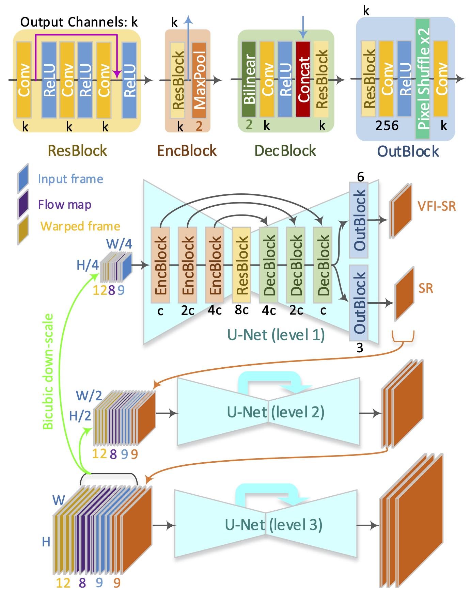
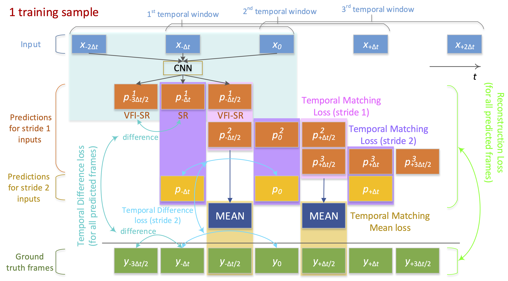

# FISR: Deep Joint Frame Interpolation and Super-Resolution with a Multi-Scale Temporal Loss

## OSS

Proposed multi-scale temporal loss to regularize STVSR.

## TAGs

#AAAI #Y2020 #video_super_resolution #video_frame_interpolation

## Methods

### Network Architecture

- As blurry frames are produced if the two overlapping frames are averaged, the frame from the latter sliding window is used for simplicity.

### Temporal Loss

- Temporal Matching Loss
    - $`L_{TM}^1 = || p_{-\Delta t/2}^1 - p_{-\Delta t/2}^2 ||_2 + || p_{+\Delta t/2}^2 - p_{+\Delta t/2}^3 ||_2`$
        - temporal stride 1 → The overlapped results should be the same (3 windows).
    - $`L_{TM}^2 = || p_{-\Delta t} - p_{-\Delta t}^1 ||_2 + || p_0 - p_0^2 ||_2+ || p_{+\Delta t} - p_{+\Delta t}^3 ||_2`$
        - temporal stride 2 $`\approx`$ temporal stride 1
- Temporal Matching Mean Loss
    - The difference between the consecutive predicted frames must be similar to the difference between the consecutive ground truth frames.
    - $`L_{TD}^1 = \sum_{w=1}^3 \sum_{s=0}^1 ||(p_{(w + \frac{s}{2} - \frac{5}{2}) \Delta t}^w - p_{(w + \frac{s}{2} - 2) \Delta t}^w) - (y_{(w + \frac{s}{2} - \frac{5}{2}) \Delta t} - y_{(w + \frac{s}{2} - 2) \Delta t}) ||_2`$
        - temporal stride 1
    - $`L_{TD}^2 = || (p_{-\Delta t} - p_0) - (y_{-\Delta t} - y_0) ||_2 + || (p_0 - p_{+\Delta t}) - (y_0 - y_{+\Delta t}) ||_2`$
        - temporal stride 2
- Reconstruction Loss
    - $`L_R^1 = \sum_{w=1}^3 \sum_{s=0}^2 || p_{(w + \frac{s}{2} - \frac{5}{2}) \Delta t}^w - y_{(w + \frac{s}{2} - \frac{5}{2}) \Delta t} ||_2`$
    - $`L_R^2 = \sum_{s=0}^2 || p_{(s-1) \Delta t} - y_{(s-1) \Delta t} ||_2`$
- Total Loss
    - $`L_T = \lambda_R \cdot L_R^1 + \lambda_{TM}^1 \cdot L_{TM}^1 + \lambda_{TMM} \cdot L_{TMM} + \lambda_{TD} \cdot L_{TD}^1 + \lambda^2 \cdot ( \lambda_{R} \cdot L_{R}^2 + \lambda_{TM}^2 \cdot L_{TM}^2 + \lambda_{TD} \cdot L_{TD}^2 )`$

## Resources

- [ARXIV: The Paper](https://arxiv.org/abs/1912.07213)
- [GitHub: Official implementation](https://github.com/JihyongOh/FISR)
