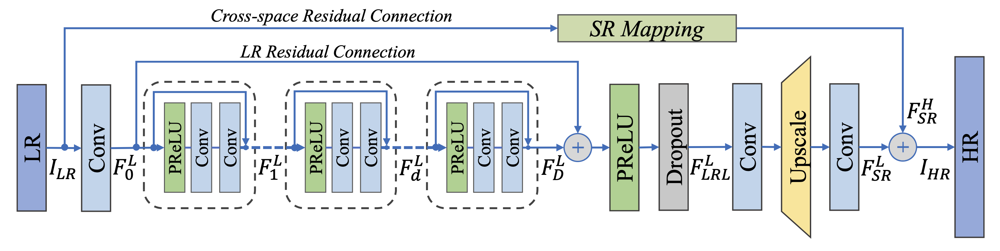
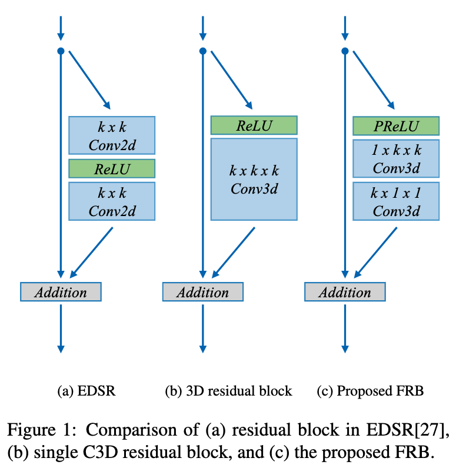

# Fast Spatio-Temporal Residual Network for Video Super-Resolution

## OSS

Proposed **factorized** 3D convolution to reduce computation costs of normal 3D convolution for spatio-temporal residual blocks.

## TAGs

#CVPR #Y2019 #video_super_resolution

## Methods

### Fast spatio-temporal residual blocks (FRBs)

- There are too much parameters in 3D convolution.
- Factorize the 3D convolution to 2 steps
    - 2D convolution (W & H)
    - 1D convolution (channel wise)
    - It is like factorizing a gaussian filter to 2 pass (horizontal & vertical).

## Resources

- [ARXIV: Paper](https://arxiv.org/abs/1904.02870)
