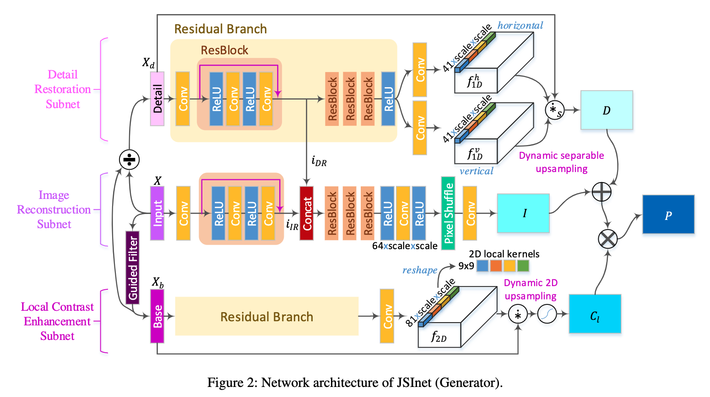

# JSI-GAN: GAN-Based Joint Super-Resolution and Inverse Tone-Mapping with Pixel-Wise Task-Specific Filters for UHD HDR Video

## OSS

Proposed a model to do spatio-color video super resolution.

## TAGs

#AAAI #Y2020 #high_dynamic_range_video #video_super_resolution

## Methods

### Detail Restoration (DR) Subnet

41 x __scale__ x __scale__ output channels (one is the horizontal 1D filter while the other one is the vertical 1D filter)
- 41: the length of the 1D separable kernel, each applied onto its corresponding grid location
- __scale__ x __scale__: tasks into account the pixel shuffling operation for the up-scaling factor __scale__.

### Local Contrast Enhancement (LCE) Subnet

The LCE subnet generates a 9x9 2D local filter at each pixel grid position.

## Resources

- [ARXIV: the paper](https://arxiv.org/abs/1909.04391)
- [AAAI: the paper](https://ojs.aaai.org/index.php/AAAI/article/view/6789/6643)
- [GitHub: official implementation](https://github.com/JihyongOh/JSI-GAN)
