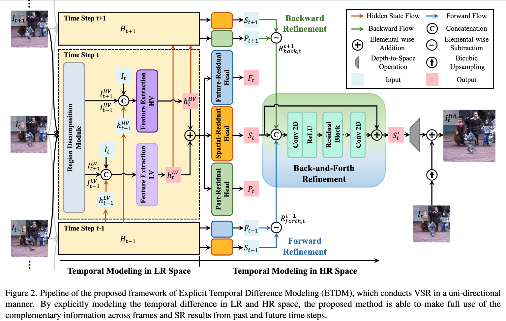

# Look Back and Forth: Video Super-Resolution with Explicit Temporal Difference Modeling

## OSS

Propose a model that separates coarse-fine features to two path and utilizes temporal differences.

## TAGs

#CVPR #Y2022 #video_super_resolution

## Methods

### Temporal difference
- $`LV`$ (low-variance) regions more likely correspond to the regions with small motion between frames.
- $`HV`$ (high-variance) regions may correspond to the regions with large motion.
- Difference masks (from 3x3 median kernel)
    - $`M^{LV}`$ : difference masks for $`LV`$ regions
    - $`M^{HV}`$ : difference masks for $`HV`$ regions. $`M^{HV} = 1 - M^{LV}`$
    - $`I_{t-1}^{LV} = M_{t-1}^{LV} \odot I_{t - 1}`$
    - $`I_{t-1}^{HV} = M_{t-1}^{HV} \odot I_{t - 1}`$
    - $`I_{t+1}^{LV} = M_{t+1}^{LV} \odot I_{t + 1}`$
    - $`I_{t+1}^{HV} = M_{t+1}^{HV} \odot I_{t + 1}`$

### Temporal modeling in LR space

- The branch for $`HV`$ regions is designed in a similar way but convolutional layers are equipped with the **dilation rate two** to handle the possible large motion with a larger receptive field.

### Temporal modeling in HR space

- The output of each branch $`h_{t-1}^{LV}`$ and $`h_{t-1}^{HV}`$ are combined and fed to three residual heads: __Spatial-Residual Head__, __Past-Residual Head__, __Future-Residual Head__.
- $`F_t = (I_t^{HR} - I_{t+1}^{HR}) - (I_t^{\uparrow} - I_{t+1}^{\uparrow})`$
- $`F_t = (I_t^{HR} - I_t^{\uparrow}) - (I_{t+1}^{HR} - I_{t+1}^{\uparrow})`$
- $`F_t`$ & $`P_t`$ are **predicted** temporal difference in HR space. So they can be supervised (as loss).

### Back-and-Forth Refinement

- It means...both past and future matters 😐
- And more than one past/future steps can be considered 😐
- Seriously? You just said you do not like bidirectional propagation cause you want to save memory 😐

## Resources

- [ARXIV: The paper](https://arxiv.org/abs/2204.07114)
