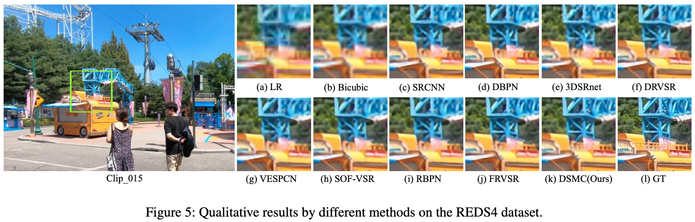
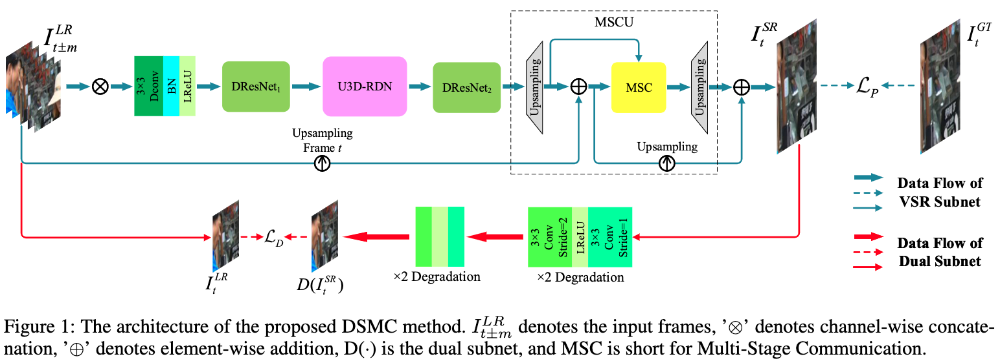
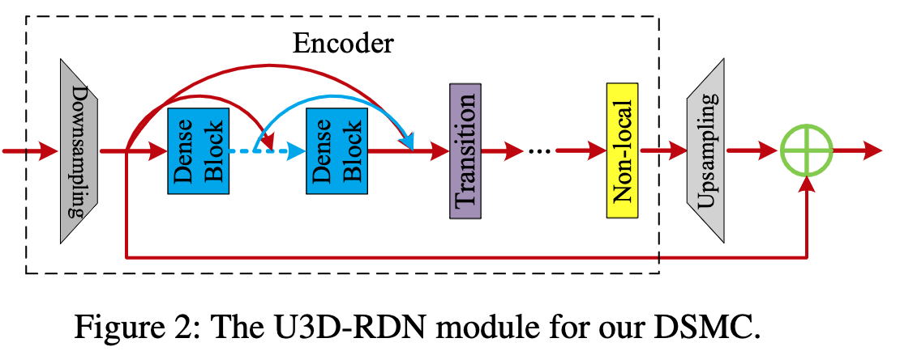
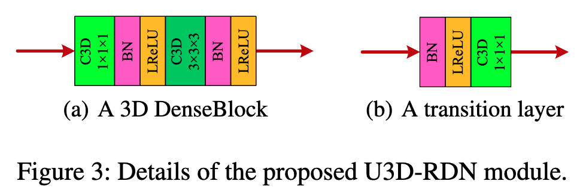
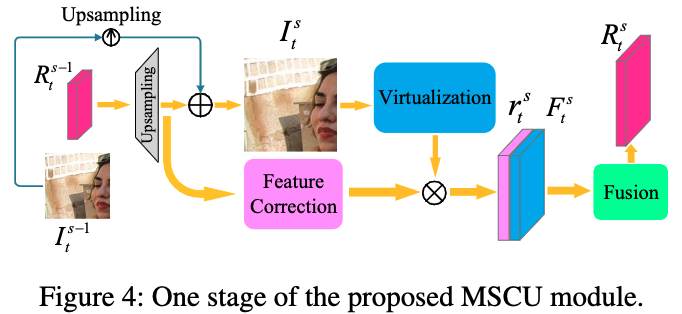

# Large Motion Video Super-Resolution with Dual Subnet and Multi-Stage Communicated Upsampling

## OSS

Proposed a network model with 3 new modules to super resolve videos with large motion.

## TAGs

#AAAI #Y2021 #video_super_resolution

## Methods

### Network Architecture

DResNet = deformable residual network, Deformable Convolution Networks.

### U3D-RDN 🤔

### Multi-Stage Communicated Upsampling ... ❓

### Dual Subnet

- The dual problem is to restore the degradation results of the VSR outputs as close as possible to the LR target frame.
- It is just the cycle consistency.

### Loss

- $`\mathcal{L} = \sum_{t=1}^{N}[ \lambda_1 \mathcal{L}_P (I_t^{SR}, I_t^{GT}) + \lambda_2 \mathcal{L}_D (D(I_t^{SR}), I_t^{LR})]`$
- $`\lambda_i, i\in \{1, 2\}`$ are constants
- $`\mathcal{L}_P (I_t^{SR}, I_t^{GT})`$, the original loss
- $`\mathcal{L}_D (D(I_t^{SR}), I_t^{LR})`$, the dual loss
- $`\mathcal{L}_P`$ and $`\mathcal{L}_D`$ can be Mean Square Error (MSE), Charbonnier (Cb), or perceptual loss. But both functions should be the same.

## Resources

- [AAAI: the paper](https://ojs.aaai.org/index.php/AAAI/article/view/16310/16117)
- [ARXIV: the paper](https://arxiv.org/abs/2103.11744)
- [GitHub: official implementation](https://github.com/iPrayerr/DSMC-VSR)
