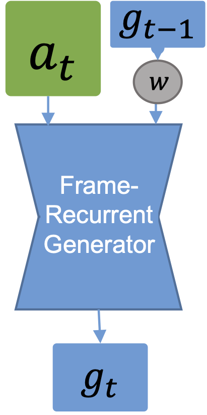
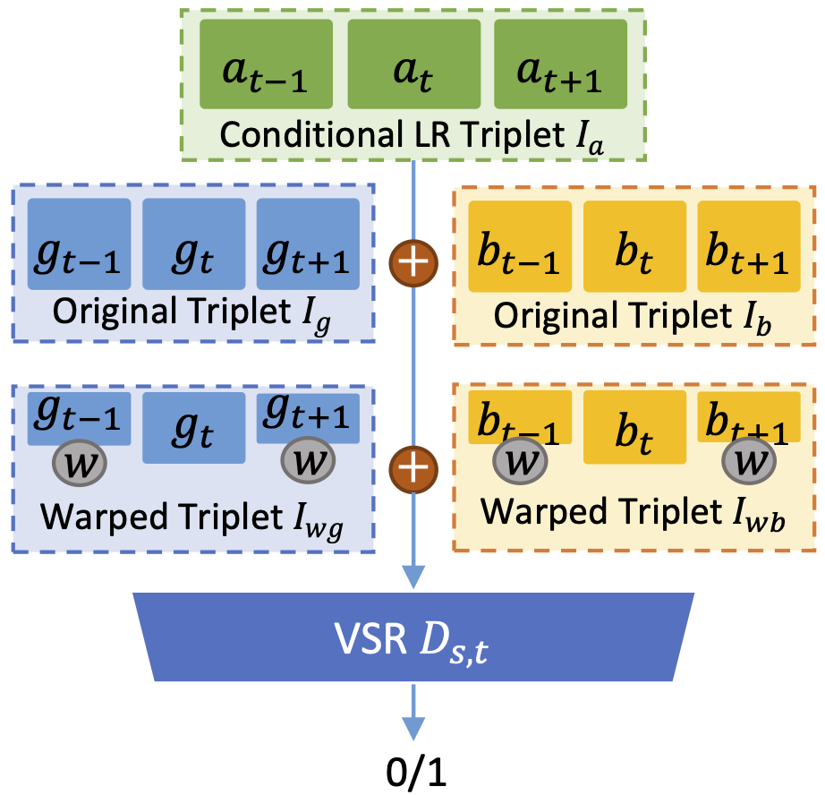
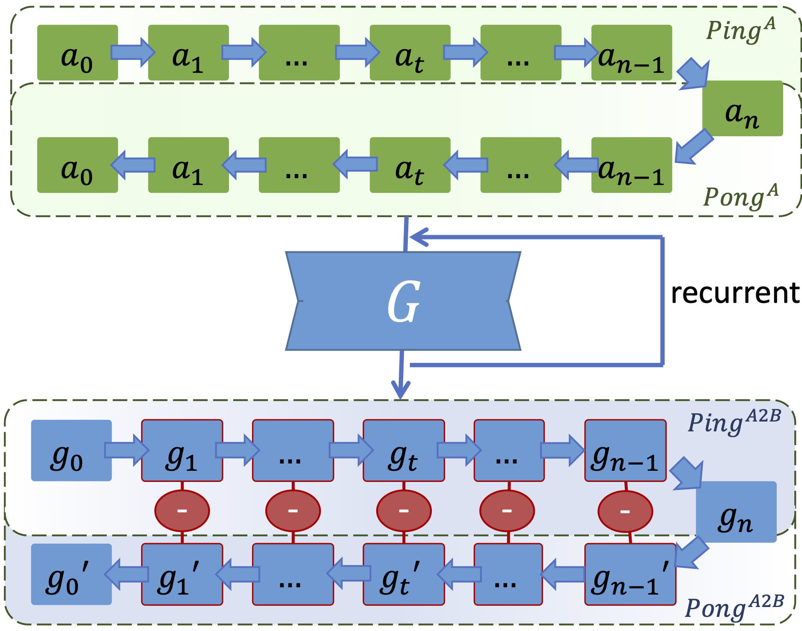

# Learning Temporal Coherence via Self-Supervision for GAN-based Video Generation

## OSS

Proposed a spatio-temporal discriminator for temporal coherence of video generation.

## TAGs

#TOG #Y2020 #gan #temporal_coherence #video_super_resolution

## Methods

### Frame-Recurrent Generator

Aligns generated frame $g_{t-1}$ to provide more information for generating frame $g_t$.

$g_t = G( a_t, W( g_{t-1}, v_t) )$

- $g_t$ : The generated frame at timestamp $t$.
- $a_t$ : The input frame at timestamp $t$.
- $v_t$ : The estimated motion from $a_{t-1}$ to $a_{t}$.
- $W$ : Warp operator.
- $G$ : The recurrent generator.

### Spatio-temporal Discriminator

- Real: $I_a \mathbin\Vert I_b \mathbin\Vert I_{wb}$
    - $I_a = a_{t-1} \mathbin\Vert a_{t} \mathbin\Vert a_{t+1}$
        - Conditional LR triplet, low resolution frames.
    - $I_b = b_{t-1} \mathbin\Vert b_{t} \mathbin\Vert b_{t+1}$
        - Original triplet, high resolution frames.
    - $I_{wb} = W( b_{t-1}, F( a_{t-1}, a_{t}) ) \mathbin\Vert b_{t} \mathbin\Vert W( b_{t+1}, F( a_{t+1}, a_{t}) )$
        - Warped high resolution triplet, provide temporal information.
- Fake: $I_a \mathbin\Vert I_g \mathbin\Vert I_{wg}$
    - $I_a = a_{t-1} \mathbin\Vert a_{t} \mathbin\Vert a_{t+1}$
        - Conditional LR triplet, LR frames.
    - $I_g = g_{t-1} \mathbin\Vert g_{t} \mathbin\Vert g_{t+1}$
        - Original triplet, super resolved frames.
    - $I_{wg} = W( g_{t-1}, F( a_{t-1}, a_{t}) ) \mathbin\Vert g_{t} \mathbin\Vert W( g_{t+1}, F( a_{t+1}, a_{t}) )$
        - Warped super resolved triplet, provide temporal information.

🚨 I am not sure if $I_{wb}$ and $I_{wg}$ are warped like in the recurrent generator. And I have difficulty on understanding the implementation.

### Ping-pong Loss

It is like cycle consistency but in a chain structure. If we can generate sequences from both direction:

- $g_0 \rightarrow g_1 \rightarrow g_2 \rightarrow ... \rightarrow g_n$
- $g_0 \leftarrow g_1 \leftarrow g_2 \leftarrow ... \leftarrow g_n$

Then the corresponding frames should be the same (the red circles).

## Resources
- [ARXIV: Paper](https://arxiv.org/abs/1811.09393)
- [Project Page](https://ge.in.tum.de/publications/2019-tecogan-chu/)
- [GitHub: Official implementation](https://github.com/thunil/TecoGAN)
    - Stuck like this [issue](https://github.com/thunil/TecoGAN/issues/99).
- [GitHub: Community docker image for the official implementation (need to build the image)](https://github.com/tom-doerr/TecoGAN-Docker)
    - Stuck like this [issue](https://github.com/thunil/TecoGAN/issues/99).
- [GitHub: Community pytorch implementation](https://github.com/skycrapers/TecoGAN-PyTorch)
- [YouTube: Official Introduction: Temporally Coherent GANs for Video Super-Resolution (TecoGAN)](https://youtu.be/pZXFXtfd-Ak)
- [YouTube: Official Introduction: TecoGAN: Learning Temporal Coherence via Self-Supervision for GAN-based Video Generation](https://youtu.be/g9O4jxrcCC0)
- [YouTube: Two Minute Papers: TecoGAN: Super Resolution Extraordinaire!](https://youtu.be/MwCgvYtOLS0)
