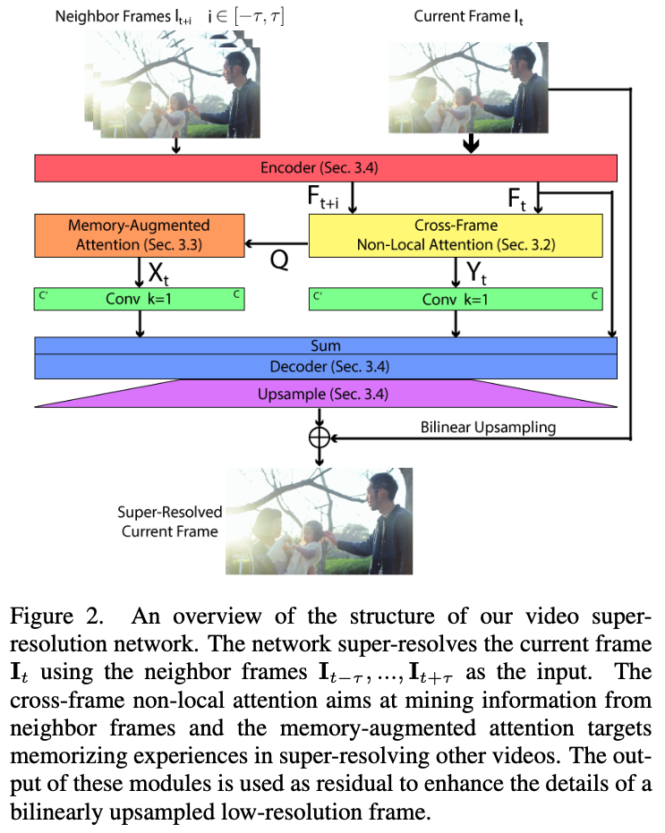
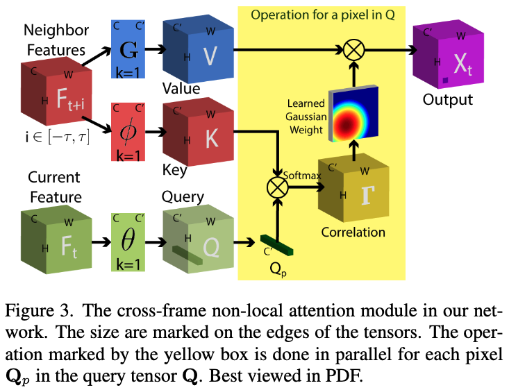
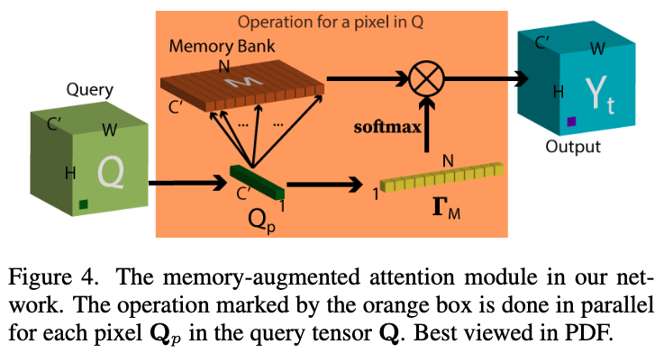

# Memory-Augmented Non-Local Attention for Video Super-Resolution

## OSS

Improve VSR by replacing optical flow with non-local attention and enhance the details with memories.

## TAGs

#CVPR #Y2022 #video_super_resolution

## Methods

### Cross-Frame Non-local Attention

Generalized version of self-attention block, refer to "[Non-local Networks](https://arxiv.org/abs/1711.07971)".

### Memory-Augmented Attention

- We seek to refer to more local detail information beyond the current video, which requires memorizing useful information from the entire training set.
- A non-local attention block that **pay attention to memories**.
- The memory is learnt from the training data.

## Resources

- [CVF: The paper](https://openaccess.thecvf.com/content/CVPR2022/papers/Yu_Memory-Augmented_Non-Local_Attention_for_Video_Super-Resolution_CVPR_2022_paper.pdf)
- [ARXIV: The paper](https://arxiv.org/abs/2108.11048)
- [GitHub: Official implementation](https://github.com/jiy173/MANA)
