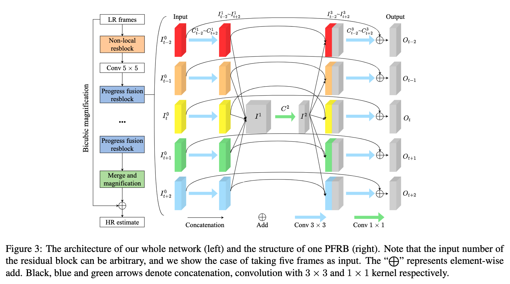
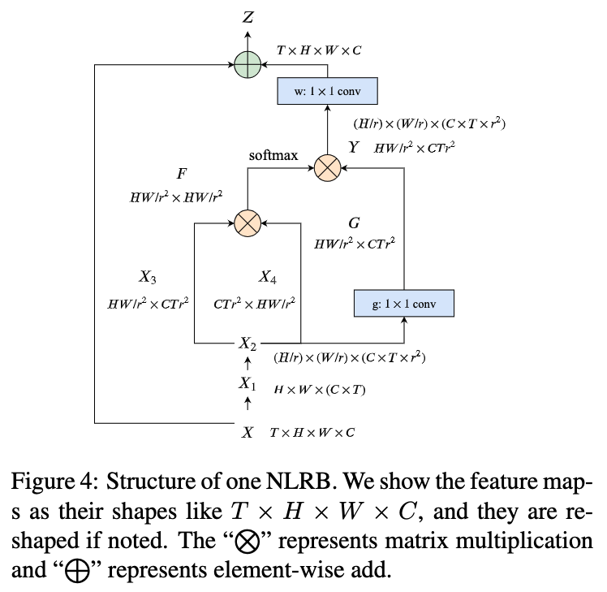

# Progressive Fusion Video Super-Resolution Network via Exploiting Non-Local Spatio-Temporal Correlations

## OSS

Proposed progressive fusion network to aggregate temporal-corrleated information for VSR.

## TAGs

#ICCV #Y2019 #video_super_resolution

## Methods

### Progressive Fusion Network

$`I_1`$ is an aggregated deep feature map contains a large deal of **temporal-correlated information**.

### Non-Local Residual Block

- Inspired by "[Attention is All You Need](https://arxiv.org/abs/1706.03762)" & "[Non-local Networks](https://arxiv.org/abs/1711.07971)".
- 👨🏼‍🦲 The attentions are not put into all spatial-temporal-values. Can stacking multiple blocks work better?

## Resources

[CVF: The paper](https://openaccess.thecvf.com/content_ICCV_2019/papers/Yi_Progressive_Fusion_Video_Super-Resolution_Network_via_Exploiting_Non-Local_Spatio-Temporal_Correlations_ICCV_2019_paper.pdf)
[GitHub: Official implementation](https://github.com/psychopa4/PFNL)
