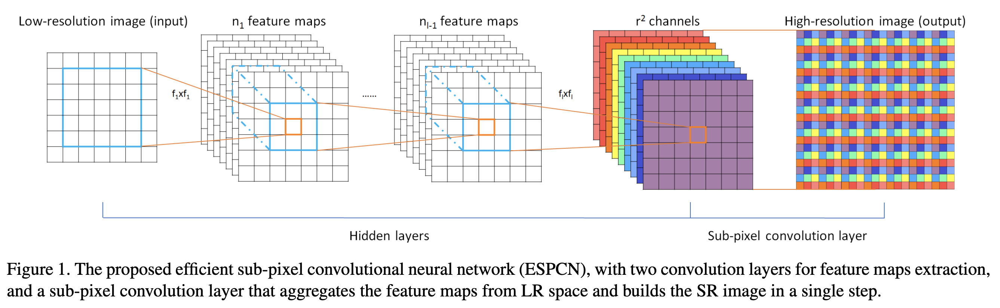

# Real-time Single Image and Video Super-Resolution Using an Efficient Sub-Pixel Convolutional Neural Network

## OSS

Proposed sb-pixel convolution layer to reduce computation cost of up-scaling.

## TAGs

#CVPR #Y2016 #image_super_resolution #video_super_resolution

## Methods

Efficient sub-pixel convolution layer

- Also know as pixel-shuffle.
- It is noticeable that the implementation of the above periodic shuffling can be very fast compared to reduction or convolution in HR space because each operation is independent and is thus trivially parallelizable in one cycle.

## Resources

- [ARXIV: The paper](https://arxiv.org/abs/1609.05158)
- [GitHub: subpixel: A subpixel convolutional neural network implementation with Tensorflow](https://github.com/atriumlts/subpixel)
