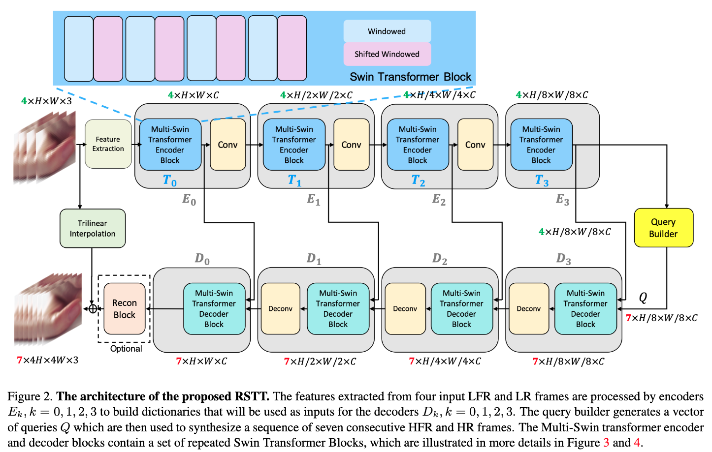
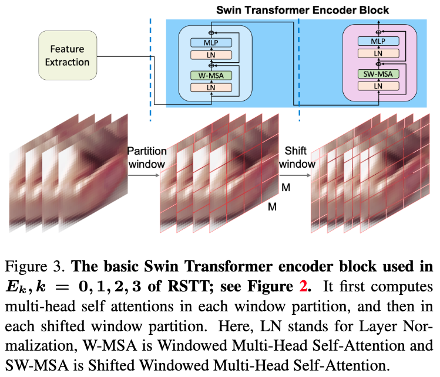
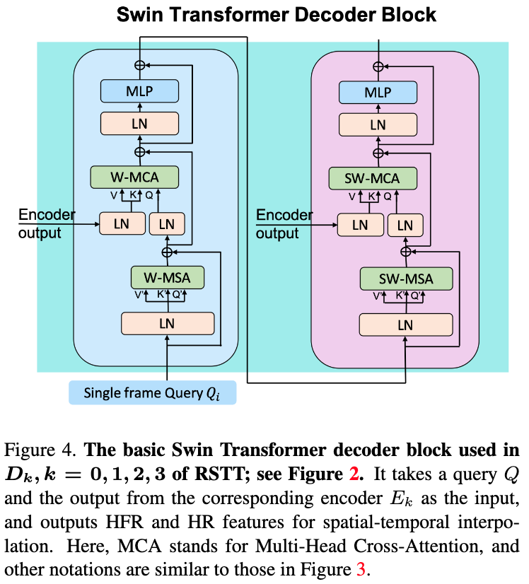

# RSTT: Real-time Spatial Temporal Transformer for Space-Time Video Super-Resolution

## OSS

Proposed a light-weight space-time video super-resolution model with Swin Transformer.

## TAGs

#CVPR #Y2022 #video_super_resolution #video_frame_interpolation

## Methods

### Overview

$`\mathcal{f} : (I_{2t-1}^L, I_{2t+1}^L, I_{2t+3}^L, I_{2t+5}^L) \mapsto (I_{2t-1}^H, I_{2t+0}^H, I_{2t+1}^H, I_{2t+2}^H, I_{2t+3}^H, I_{2t+4}^H, I_{2t+5}^H)`$

### Encoder

- $`T_0 = \mathcal{T}_{swin} (F_{2t-1}^L, F_{2t+1}^L, F_{2t+3}^L, F_{2t+5}^L)`$
    - $`F_{2t-1}^L`$: feature map of low-resolution of (2__t__ - 1)-th frame (which is $`E_{-1}`$).
    - $`\mathcal{T}_{swin}`$ : Swin Transformer
- $`E_0 = \Phi (T_0)`$
    - $`\Phi`$ : the convolutional block
- $`T_1 = \mathcal{T}_{swin} (E0)`$, and so on and so forth.

### Decoder

- $`Q := (E_{3,2t-1}, \frac{1}{2} (E_{3,2t-1} + E_{3,2t+1}), E_{3,2t+1}, \frac{1}{2} (E_{3,2t+1} + E_{3,2t+3}),E_{3,2t+3}, \frac{1}{2} (E_{3,2t+3} + E_{3,2t+5}),E_{3,2t+5} )`$
    - $`Q`$ is $`D_4`$
- $`D_3 = \Phi^{-1} ( \mathcal{T}_{swin}^{-1} ( T_3, D_4 ) )`$
    - $`\mathcal{T}_{swin}^{-1}`$ : Swin Transformer decoder block.
    - $`\Phi^{-1}`$ : deconvolutional block.
    - and so on and so forth

### Final reconstruction module.

- pixel shuffle operation
- Use a trilinear interpolation of the input frames to work as a warming start of the output frames.

### Limitations

- Long training time.
- Lack the flexibility to interpolate at arbitrary time stamps.

## Resources

- [CVF: the paper](https://openaccess.thecvf.com/content/CVPR2022/papers/Geng_RSTT_Real-Time_Spatial_Temporal_Transformer_for_Space-Time_Video_Super-Resolution_CVPR_2022_paper.pdf)
- [ARXIV: the paper](https://arxiv.org/abs/2203.14186)
- [GitHub: Official Implementation](https://github.com/llmpass/RSTT)
- [YouTube: Demo](https://youtu.be/UItUdbLEPHM)
