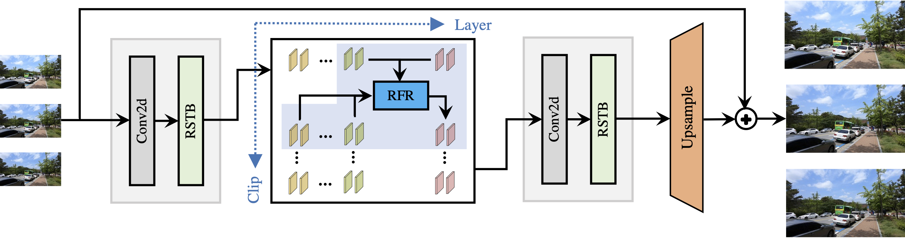
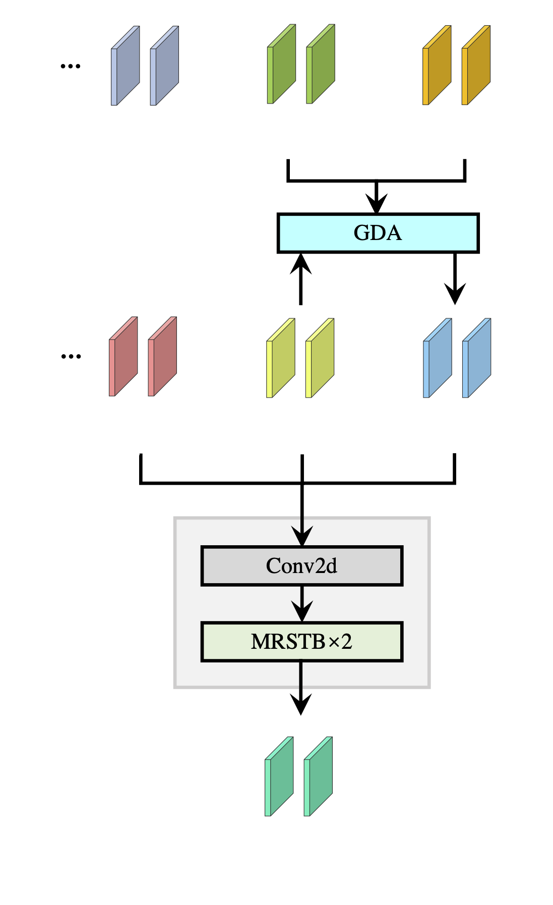
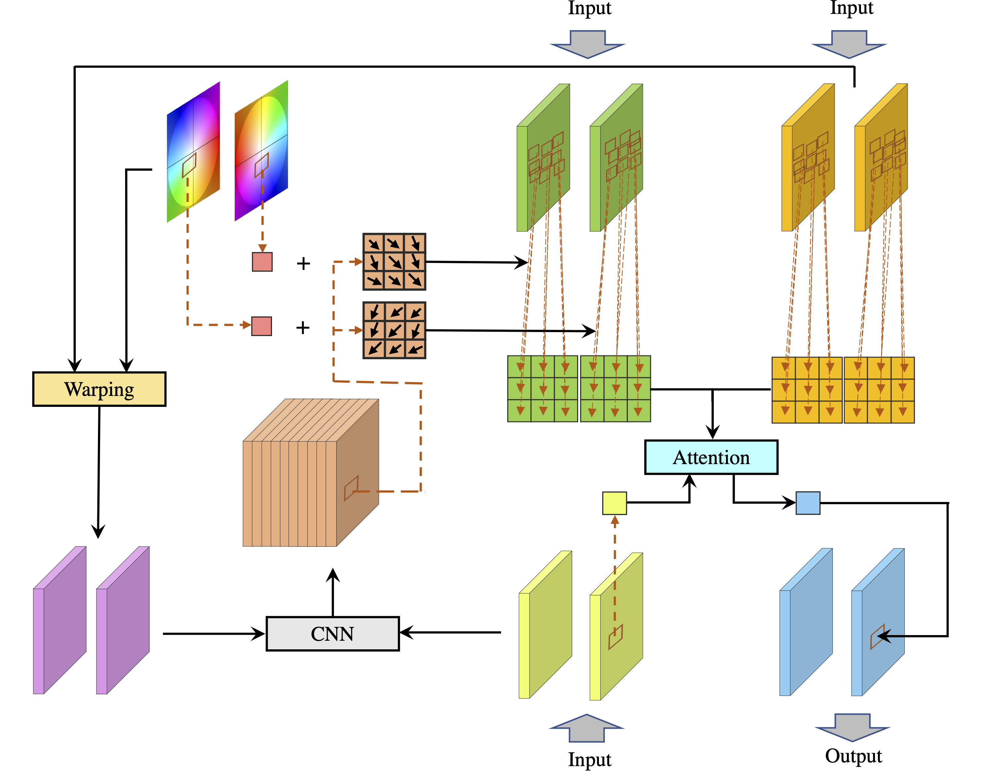

# Recurrent Video Restoration Transformer with Guided Deformable Attention

## OSS

Proposed a video restoration model that balances recurrent (frame by frame) and parallel (all frames at once) methods.

## TAGs

#NeurIPS #Y2022 #video_denosing #video_deblurring

## Methods

### Recurrent Feature Refinement

- Globally, features of different video clips are propagated in a recurrent way.
- Locally, features of different frames are updated jointly in parallel.
- RVRT is a generalization of both recurrent and transformer models. It becomes a recurrent model when N = 1 (one frame per clip) or a transformer model when N = T (all frames within one clip).
- For recurrent feature refinement, we use 4 refinement modules with a clip size of **2**.

### Guided Deformable Attention for Video Alignment

- Use SpyNet to predict the initial flows.
- Attention
    - Deformable: __K__ & __V__ are warped to __Q__.
    - The default size of the attention window is 3x3.
- Suppose the clip size is 2 (frames) and we have 2 clips:
    - clip_0: frame_0, frame_1
    - clip_1: frame_2, frame_3
    - frame_0 & frame_1 at $`layer_{i - 1}`$ are both warped to align with frame_0 → __K__.
    - frame_0 & frame_1 at $`layer_{i}`$ are both warped to align with frame_0 → __V__.

## Resources

- [ARXIV: The paper](https://arxiv.org/abs/2206.02146).
- [GitHub: The official implementation](https://github.com/JingyunLiang/RVRT).
