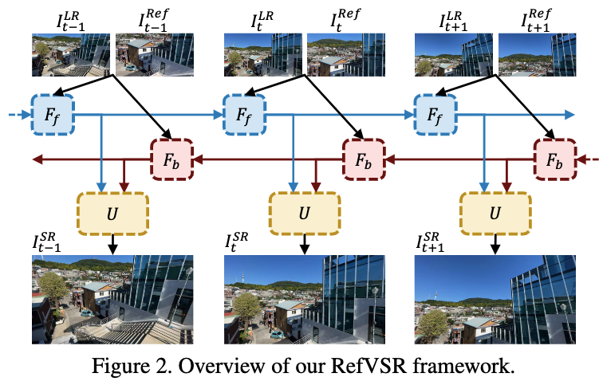

# Reference-based Video Super-Resolution Using Multi-Camera Video Triplets

## OSS

Uses high-resolution video frames as reference to super-resolve low-resolution video frames.

## TAGs

#CVPR #Y2022 #video_super_resolution

## Methods

- Dual camera
    - $`I_{t}^{LR}`$ : low resolution (larger FOV)
    - $`I_{t}^{Ref}`$ : high resolution (smaller FOV)
- Basically, this is a bi-directional VSR. Excepts it uses a high-resolution-frame as reference to enhance the SR results.
- Uses cosine similarity to align the features of $`I_t^{LR}`$ & $`I_t^{Ref}`$.

## Resources

- [Project page](https://junyonglee.me/projects/RefVSR/)
- [GitHub: Official implementation](https://github.com/codeslake/RefVSR)
- [YouTube: Presentation](https://youtu.be/DwvJgmCODH4)
