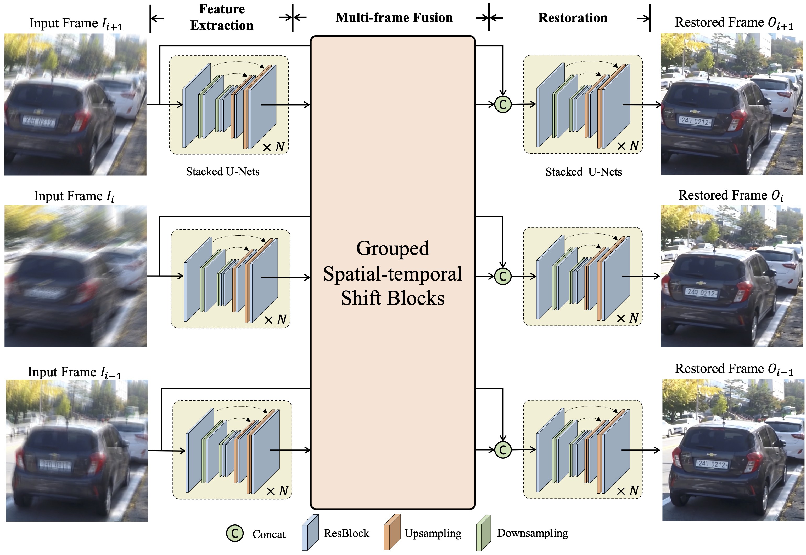
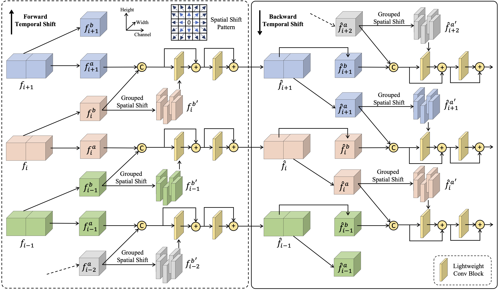

# A Simple Baseline for Video Restoration with Grouped Spatial-temporal Shift

## OSS

Proposed grouped spatial-temporal shift for temporal feature aggregation.

## TAGs

#CVPR #Y2023 #video_denosing #video_deblurring

## Methods

Three stages are all U-Nets.

### Grouped Spatial-temporal Shift
- The GSTS blocks are not applied at the finest scale to save the computational cost.
- A GSTS block consists of 3 components
    - Grouped temporal shift: It's ... **recurrent**.
    - Grouped spatial shift: It's ... **convolutions**.
        - Normal convolution: $`w_{x-1} P_{x-1} + w_{x} P_{x} + w_{x+1} P_{x+1}`$
        - GSS: $`w_{x-1} P_{x-1} | w_{x} P_{x} | w_{x+1} P_{x+1}`$, concatenating instead of adding.
    - Fusion layer.

## Resources

- [ARXIV: The paper](https://arxiv.org/abs/2206.10810)
- [Page: Project page](https://dasongli1.github.io/publication/grouped-shift-net/)
- [GitHub: Official implementation](https://github.com/dasongli1/Shift-Net)
