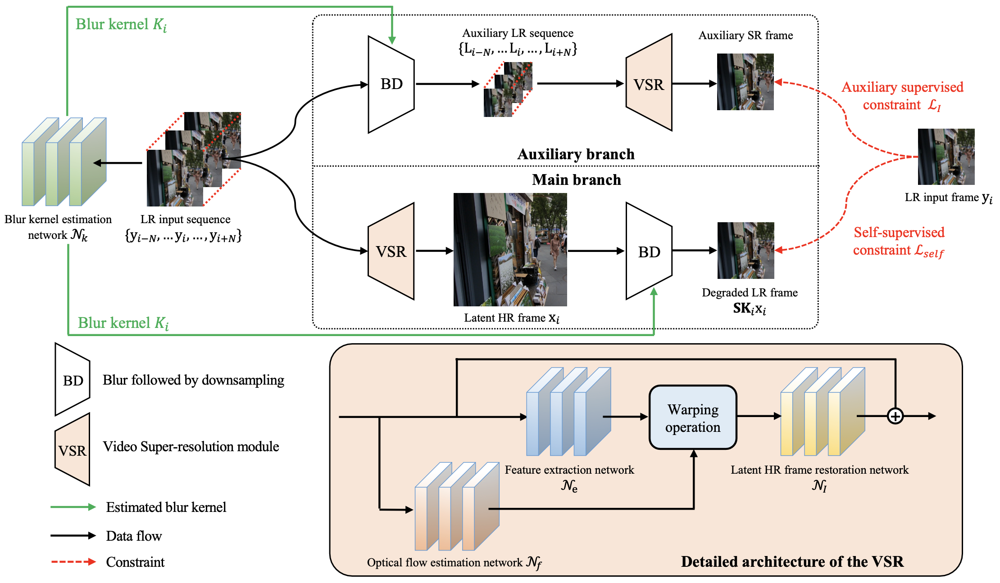

# Self-Supervised Deep Blind Video Super-Resolution

## OSS

Proposed a self-supervised learning algorithm for VSR.

## TAGs

#ARXIV #Y2022 #video_super_resolution

## Methods

### Sub-networks

- $\mathcal{N}_k$ estimates the blur kernel of LR images.
- Path 1: LR → Blur → Downsample → VSR ↔ LR : $\mathcal{L}_I$
    - 👨🏼‍🦲: It's not that accurate since the degradation now is accumulated (original images have degradation already).
    - 👨🏼‍🦲: Objects in different paths are in different scale → may work better in different scales? (e.g. large face vs small face)
- Path 2: LR → VSR → Blur → Downsample ↔ LR : $\mathcal{L}_{self}$
    - Self supervised

### Loss
- $\mathcal{L} = \mathcal{L}_{self} + \lambda \mathcal{L}_I + \gamma \mathcal{L}_k$
    - $\mathcal{L}_{self}$ leads to trivial solutions, need the other constraints.
    - $\mathcal{L}_k = || K_i || ^ \alpha$ → model the sparse property of the blur kernel → $\alpha = 0.5$.
### Online fine-tuning on real scenarios
- As our method does not require ground truth HR videos as the supervision, real-world degraded videos can be used to fine-tune our method for better generalization.
- As the corresponding ground truth HR videos are not available, we use the non-reference metric [NIQE](https://github.com/EadCat/NIQA) to evaluate the proposed method.

## Resources

- [ARXIV: Paper](https://arxiv.org/abs/2201.07422)
- [GitHub: Project page](https://github.com/csbhr/Self-Blind-VSR)
