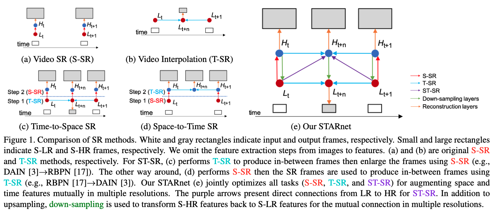
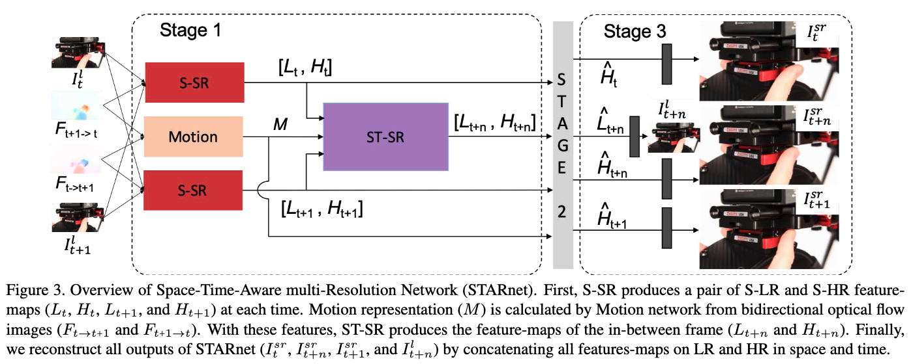

# Space-Time-Aware Multi-Resolution Video Enhancement

## OSS

Proposed a Spatio Temporal VSR framework.

## TAGs

#CVPR #Y2020 #video_super_resolution #video_frame_interpolation

## Methods

### Stage 1 - Initialization

- We use flow images pre-computed by
    - Beyond pixels: exploring new representations and applications for motion analysis
- Spatial SR
    - $`H_t = \mathsf{Net}_S(I_t^l,I_{t+1}^l,F_{t+1 \to t};\theta_s)`$
    - $`H_{t+1} = \mathsf{Net}_S(I_{t+1}^l,I_{t}^l,F_{t \to t+1};\theta_s)`$
    - $`L_t = \mathsf{Net}_D(H_t; \theta_d)`$
    - $`L_{t+1} = \mathsf{Net}_D(H_{t+1}; \theta_d)`$
    - $`\mathsf{Net}_S`$ produce feature maps
    - $`\mathsf{Net}_D`$ downscaled feature maps
    - **NOTE**:
        - this model extract high-resolution-features, then extract low-resolution-features by down-scaling it.
        - the other models extract low-resolution-features, then extract high-resolution-features by up-scaling it.
- Motion
    - $`M = \mathsf{Net}_M (F_{t \to t+1},F_{t+1 \to t}; \theta_m)`$
    - $`\mathsf{Net}_M`$ produce a motion representation which is calculated from the bidirectional optical flows
- Spatial-Temporal SR
    - $`H_{t+n}, L_{t+n} = \mathsf{Net}_{ST} (H_t,H_{t+1},L_t,L_{t+1},M;\theta_{st})`$

### Stage 2 - Refinement

- further maintains the cycle consistencies for refining the feature-maps again.
- While raw optical flows are used in Stage 1, the motion feature (__M__) is used in stage 2. This difference allows us to produce more reliable feature-maps.
- T = t
    - $`H_t^b = \mathsf{Net}_B (L_{t+n}, L_{t}, M; \theta_b)`$
    - $`L_t^b = \mathsf{Net}_D (H_t^b; \theta_d)`$
    - $`\hat{H}_t = H_t + \mathsf{ReLU}(H_t - H_t^b)`$
    - $`\hat{L}_t = L_t + \mathsf{ReLU}(L_t - L_t^b)`$
- T = t + 1
    - $`H_{t+1}^f = \mathsf{Net}_F (L_{t+n}, L_{t+1}, M; \theta_f)`$
    - $`L_{t+1}^f = \mathsf{Net}_D (H_{t+1}^f; \theta_d)`$
    - $`\hat{H}_{t+1} = H_{t+1} + \mathsf{ReLU}(H_{t+1} - H_{t+1}^f)`$
    - $`\hat{L}_{t+1} = L_{t+1} + \mathsf{ReLU}(L_{t+1} - L_{t+1}^f)`$
- T = t + n
    - $`H_{t+n}^f = \mathsf{Net}_F (\hat{L}_t, L_{t+n}, M; \theta_f)`$
    - $`L_{t+n}^f = \mathsf{Net}_D (H_{t+n}^f; \theta_d)`$
    - $`H_{t+n}^b = \mathsf{Net}_B ( \hat{L}_{t+1}, L_{t+n}, M; \theta_b )`$
    - $`L_{t+n}^b = \mathsf{Net}_D ( H_{t+n}^b; \theta_d )`$
    - $`\hat{H}_{t+n} = H_{t+n} + \mathsf{ReLU}(H_{t+n} - H_{t+n}^f) + \mathsf{ReLU}(H_{t+n} - H_{t+n}^b)`$
    - $`\hat{L}_{t+n} = L_{t+n} + \mathsf{ReLU}(L_{t+n} - L_{t+n}^f) + \mathsf{ReLU}(L_{t+n} - L_{t+n}^b)`$

### Stage 3 - Reconstruction

- $`I_t^{sr} = \mathsf{Net}_{rec} ( \hat{H}_t; \theta_{rec} )`$
- $`I_{t+n}^{sr} = \mathsf{Net}_{rec} ( \hat{H}_{t+n}; \theta_{rec} )`$
- $`I_{t+1}^{sr} = \mathsf{Net}_{rec} ( \hat{H}_{t+1}; \theta_{rec} )`$
- $`I_{t+n}^{l} = \mathsf{Net}_{rec} ( \hat{L}_{t+n}; \theta_{rec} )`$

### Loss

- $`L_1 = \sum_{t=0}^T || I_t^h - I_t^{sr} ||_1`$
- $`L_{vgg} = \sum_{t=0}^T || f_m(I_t^h) - f_m(I_t^{sr}) ||_2^2`$

## Resources

- [ARXIV: Paper](https://arxiv.org/abs/2003.13170)
- [GitHub: Project page](https://alterzero.github.io/projects/STAR.html)
- [GitHub: Official implementation](https://github.com/alterzero/STARnet)
- [YouTube: Introduction](https://youtu.be/h0szU3WXLtg)
