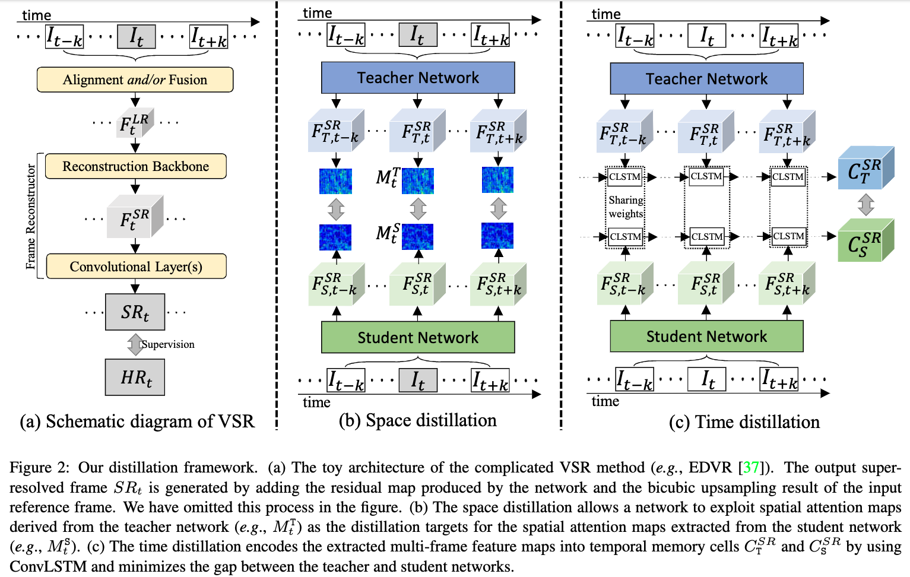
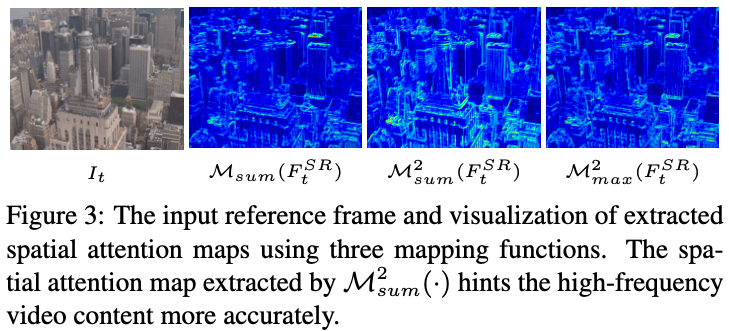

# Space-Time Distillation for Video Super-Resolution

## OSS

Proposed a space-time distillation (STD) scheme to exploit both spatial and temporal knowledge in the VSR task.

## TAGs

#CVPR #Y2021 #video_super_resolution

## Methods

- Space Distillation (SD). See Space distillation loss.
    - 
- Time Distillation (TD). See time distillation loss.
- Reconstruction loss.
    - Charbonnier loss.
    - $`\mathcal{L}_{rec} = \sqrt{||SR_t - HR_t||^2 + \epsilon^2}`$
- Space distillation loss.
    - Spatial attention map. $`M_t^{T/S} = \mathcal{M}_{sum}^2(F_{T/S,t}^{SR}) = \sum_{i=1}^C | F_{T/S,t}^{SR} |^2`$
    - $`\mathcal{L}_{SD} = \frac{1}{N} \sum_{t=1}^{N} \mathcal{L}_d (M_t^S, M_t^T)`$
    - $`\mathcal{L}_d`$ is typically defined as the L2-norm distance.
- Time distillation loss.
    - Temporal memory cell: $`C^{SR}`$
    - $`(C_{T/S}^{SR}, h_{T/S,t+k}) = ConvLSTM(F_{T/S,t+k-1}^{SR}, h_{T/S,t+k-1})`$
    - $`\mathcal{L}_{TD} = \mathcal{L}_d (C_T^{SR}, C_S^{SR})`$
    - $`\mathcal{L}_d`$ is typically defined as the L2-norm distance.
- Loss for the student network S is $`\mathcal{L} = \mathcal{L}_{rec} + \lambda_1 \mathcal{L}_{SD} + \lambda_2 \mathcal{L}_{TD}`$

## Resources

- [CVF: the paper](https://openaccess.thecvf.com/content/CVPR2021/papers/Xiao_Space-Time_Distillation_for_Video_Super-Resolution_CVPR_2021_paper.pdf)
