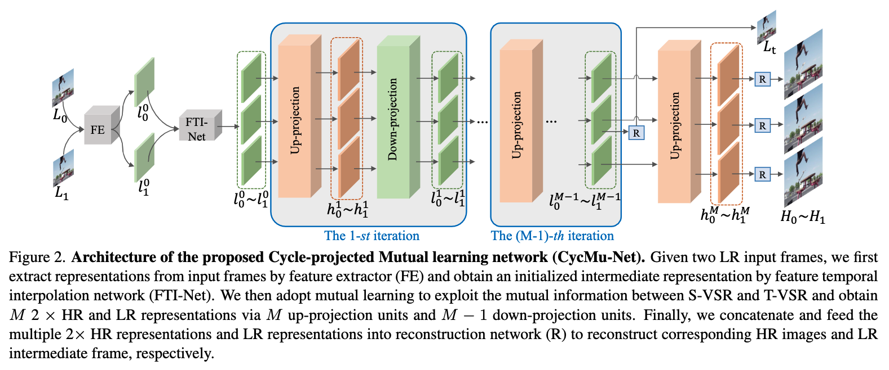
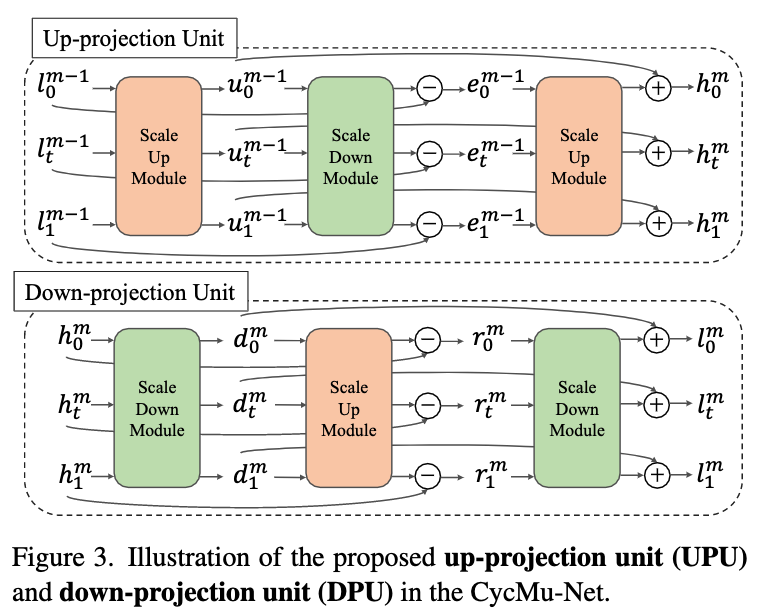

# Spatial-Temporal Space Hand-in-Hand: Spatial-Temporal Video Super-Resolution via Cycle-Projected Mutual Learning

## OSS

Utilizes the deep-back projection architecture for STVSR.

## TAGs

#CVPR #Y2022 #video_super_resolution #video_frame_interpolation

## Methods

### Cycle-Projected Mutual Learning

- Inspired by [Deep Back-Projection Networks For Super-Resolution](https://arxiv.org/abs/1803.02735)
- $`[u_0^{m-1}, u_t^{m-1}, u_1^{m-1}] = UP_0([l_0^{m-1}, l_t^{m-1}, l_1^{m-1}])`$
- $`UP_0(\cdot)`$ denotes the scale up module. It first performs multi-frame progressive fusion  by fusion resblocks,which implicitly exploit intra-frame spatial correlations and inter-frame temporal correlations, then upsamples each feature by bilinear interpolation and 1×1 convolution. Refer to [Progressive Fusion Video Super-Resolution Network via Exploiting Non-Local
Spatio-Temporal Correlations](https://github.com/psychopa4/PFNL)

### Spatial-Temporal Video Super-Resolution

- Feature temporal interpolation network. Along with the motion offsets estimation, we adopt **deformable convolution** to interpolate forward and backward representations from the missing intermediate frames.
- Reconstruction network

## Resources

[Codes are publicly available at ... ???](https://github.com/hhhhhumengshun/CycMuNet)
