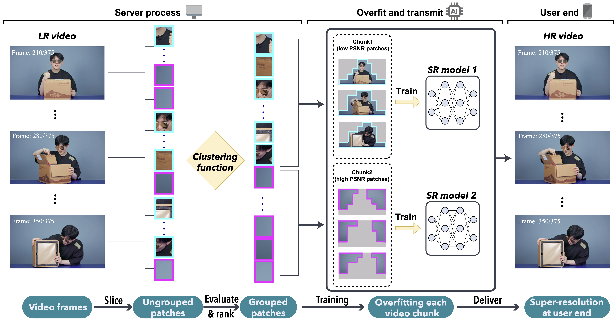
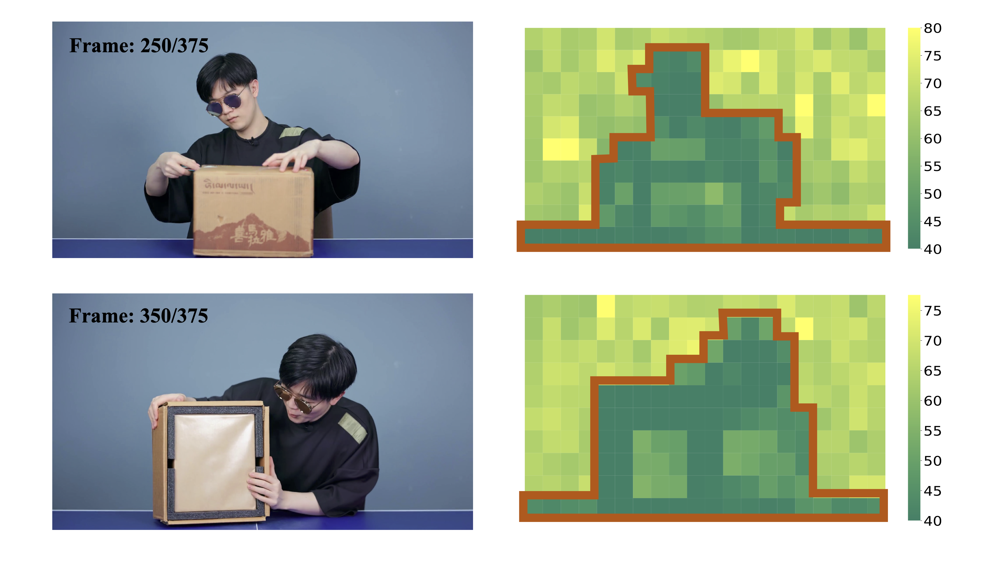

# Towards High-Quality and Efficient Video Super-Resolution via Spatial-Temporal Data Overfitting

## OSS

Proposed a non-blind video super resolution framework leveraging the unbalanced information density within video frames.

## TAGs

#CVPR #Y2023 #video_super_resolution

## Methods

### Concepts

- As illustrated in Figure 1, when using a general SR model to super-resolve an LR video, the values of PSNR at different patch locations form a clear boundary, and are strongly related to the content of the current video frame (i.e., spatial information).

- With the different levels of information density within each patches, the key insight is to **cluster patches** that has similar texture complexity across all frames, and use one SR model to overfit each patch group.

### Framework

- We use a pretrained SR model $`f_0 (\cdot)`$ to super-resolve all of the LR patches and compute their PSNR with the HR patches.
- We divide the training set $`\mathcal{D}`$ (all patches across all dimensions, spatio and temporal) into multiple chunks by grouping patches with similar PSNRs, and form a set of chunks as $`\Omega = \{ \hat{\mathcal{D}}_0, \hat{\mathcal{D}}_1, ..., \hat{\mathcal{D}}_k \}`$.
- Our empirical analysis is that by accurately identifying and grouping the data with similar information density (i.e, texture complexity) into chunks, each SR model becomes easier to “memorize” similar data in an overfitting task, and subsequently demands smaller SR models that can be executed in a realtime fashion.

### Data-Aware Joint Training

- We find out that using the model trained with $`\hat{\mathcal{D}}_0`$ (i.e., the most informative chunk, lowest PSNRs) experiences a moderate quality drop, and achieves similar or higher PSNR compared to the model trained with all patches.
- Concretely, we keep all patches for $`\hat{\mathcal{D}}_0`$ , and remove the entire $`\hat{\mathcal{D}}_k`$ (the least informative chunk, highest PSRs). For the rest of the chunks, we randomly sample a portion of the patches from each chunk, while gradually decreasing the proportion of the data sampled. **→ Generating a single SR model for the entire video to further reduces the storage requirement with negligible quality drop.**

## Inspiration

Instead of estimating scores of each patch for different VSR models (e.g. faces vs scenes), we may score each patch with some pre-trained models (because we are doing non-blind SR. If a face SR model gets high scores on certain patches, just group them. We do not care if they are really faces).

## Resources

- [GitHub: Official implementation](https://github.com/coulsonlee/STDO-CVPR2023/)