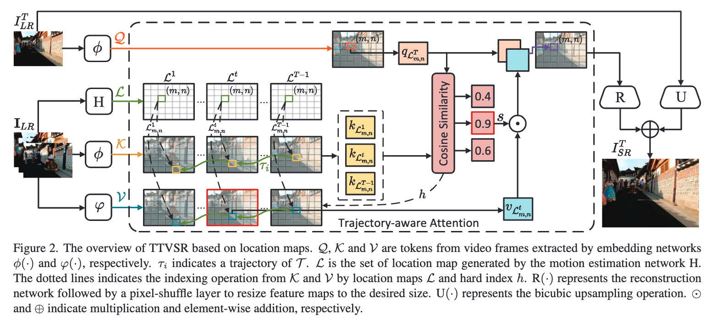
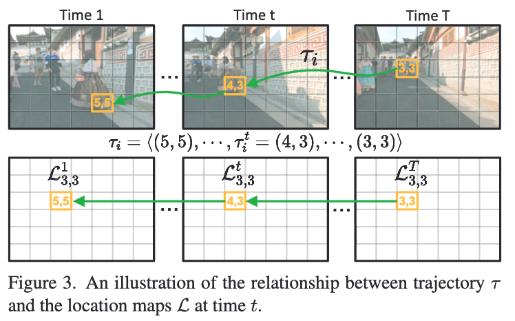

# TT-VSR: Learning Trajectory-Aware Transformer for Video Super-Resolution

## OSS

Fues each feature with the most relevant feature along its trajectory to enhance the VSR results.

## TAGs

#CVPR #Y2022 #video_super_resolution

## Methods

### Fuse a feature with the most relevant feature along it trajectory (trajectory-aware attention)

See the cosine similarity block.

- The $`h`$ (hard-attention) uses the similarity to find the best fit ( $`argmax`$ ).
- The $`s`$ (soft-attention) uses the similarity to weight the best fit ( $`arg`$ ).
- It's like transformer's attention but not using weighting sum.

### Location Maps for Trajectory Generation

Specifically, $`O^{T+1}`$ can build the connection of trajectories between time $`T`$ and time $`T+1`$ and obtain from a lightweight motion estimation network.

## Resources

- [CVF: The paper](https://openaccess.thecvf.com/content/CVPR2022/papers/Liu_Learning_Trajectory-Aware_Transformer_for_Video_Super-Resolution_CVPR_2022_paper.pdf)
- [ARXIV: The paper](https://arxiv.org/abs/2204.04216)
- [GitHub: Official implementation](https://github.com/researchmm/TTVSR)
