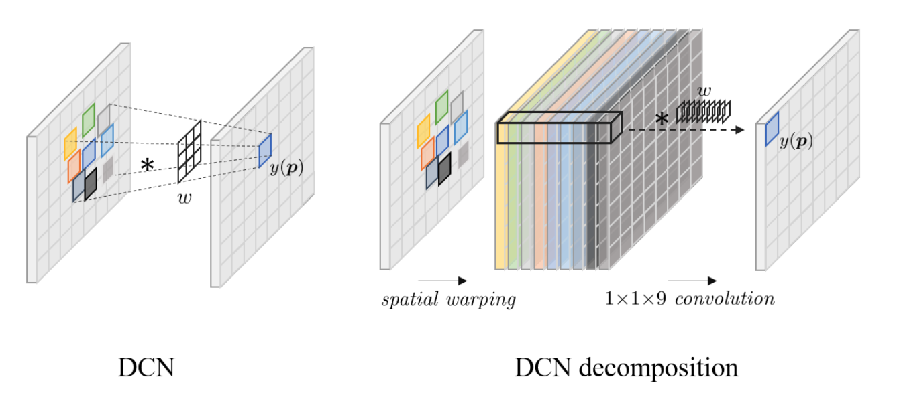

# Understanding Deformable Alignment in Video Super-Resolution

## OSS

Studied the relationship between deformable and flow-based alignment and proposed approach to increase offset diversity.

## TAGs

#AAAI #Y2021 #video_super_resolution

## Methods

- Deformable alignment is like
    - Step 1. Flow the features (optical flow)
    - Step 2. Do CNN on the flowed feature.
    - Step 1 + 2 → One DCN cell (no offset diversity, 1/9 of the 3x3 kernel)
- DCN (Deformable Convolutional Network)
    - 9 (3x3) offset diversity.
    - If __N__ warped features are stacked → __N__ offset diversity → __N__ can be arbitary.
    - Decomposed to flow and CNN.
    - 👨🏼‍🦲: __N__ warped features are like __N__-head?
- Increasing offset diversity increases the performance, but it saturates eventually.
- Increasing offset collects information for occluded areas.

## Resources

- [ARXIV: The paper](https://arxiv.org/abs/2009.07265)
- [AAAI: The paper](https://ojs.aaai.org/index.php/AAAI/article/view/16181/15988)
- [Project page](https://ckkelvinchan.github.io/projects/DCN/)
- [GitHub: Official implementation of the offset-fidelity loss](https://github.com/ckkelvinchan/offset-fidelity-loss)

