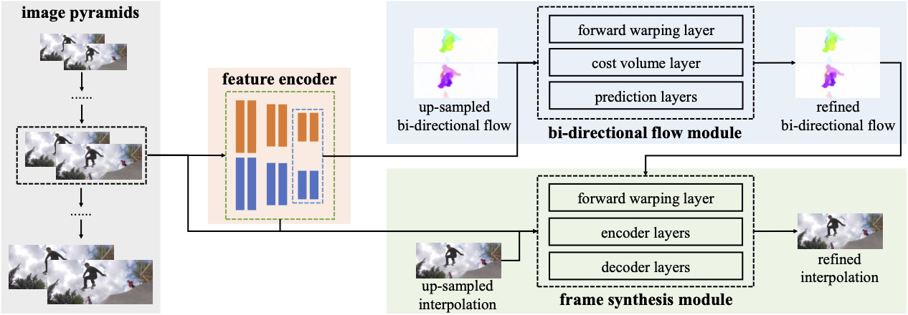
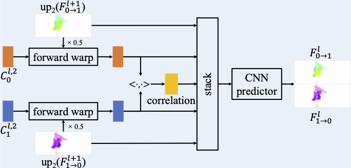
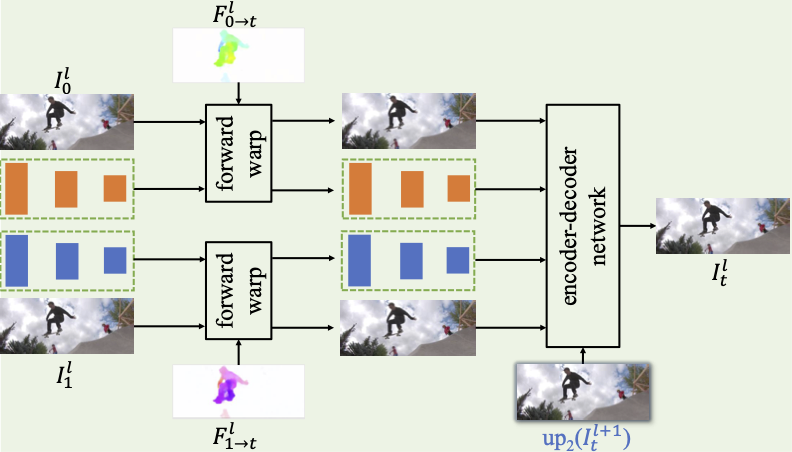

# A Unified Pyramid Recurrent Network for Video Frame Interpolation

## OSS

Proposed a pyramid network that unify optical flow and frame synthesis networks in each layer.

## TAGs

#CVPR #Y2023 #video_frame_interpolation

## Methods

### Unified Pyramid Recurrent Network

- Both optical flows and interpolated frames depend on the same features (the feature encoder in the orange block).
- Both optical flows and interpolated frames depend on their coarse version (lower resolution in the pyramid).

### Bi-directional flow module

- Scales up the flow map from lower pyramid layer ( $up_2(F_{0 \rightarrow 1}^{l+1})$ ). Then use the flow map to flow the features to the intermediate time position (forward warp x 0.5).
- Use the correlation between two flowed features (the two forward warped blocks) to fine tune the up scaled flow maps.

### Frame synthesis module

- Forward warps both extracted features and frames to the intermediate time position.
- Fuse forward warped frames, warped features and the up scaled intermediate frame (from lower resolution pyramid layer) to synthesize the interpolated frame of current layer.

## Resources

- [ARXIV: Paper](https://arxiv.org/abs/2211.03456)
- [GitHub: Official implementation](https://github.com/srcn-ivl/UPR-Net)
