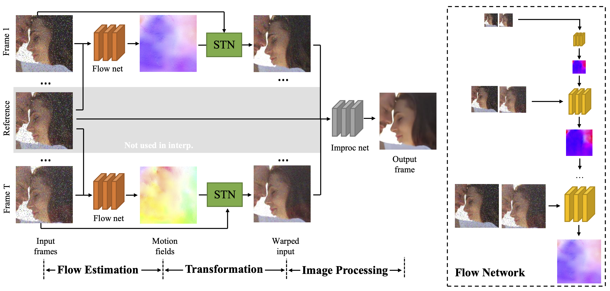
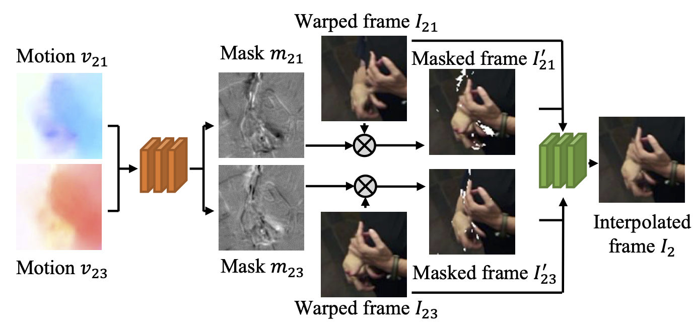

# Video Enhancement with Task-Oriented Flow

## OSS

Proposed a unified framework with optical flow for video super resolution, interpolation,  denoising and deblocking.

## TAGs

#IJCV #Y2019 #video_super_resolution #video_frame_interpolation #video_denosing

## Methods

### Flow Estimation Module

- Retrain "Optical Flow Estimation using a Spatial Pyramid Network" with different tasks (VSR/VFI/Denoising/Deblocking). It is task oriented. One model for each task.
- There is a significant performance drop when we use a flow network that is not trained on that task.

### Occluded regions in warped frames

- It predicts two occlusion masks. The invalid regions in the warped frames are masked out by multiplying them with their corresponding masks.

## Resources

- [Project page](http://toflow.csail.mit.edu/)
- [ARXIV: The paper](https://arxiv.org/abs/1711.09078)
- [YouTube: Demo](https://youtu.be/msC5GK9aV9Q)
