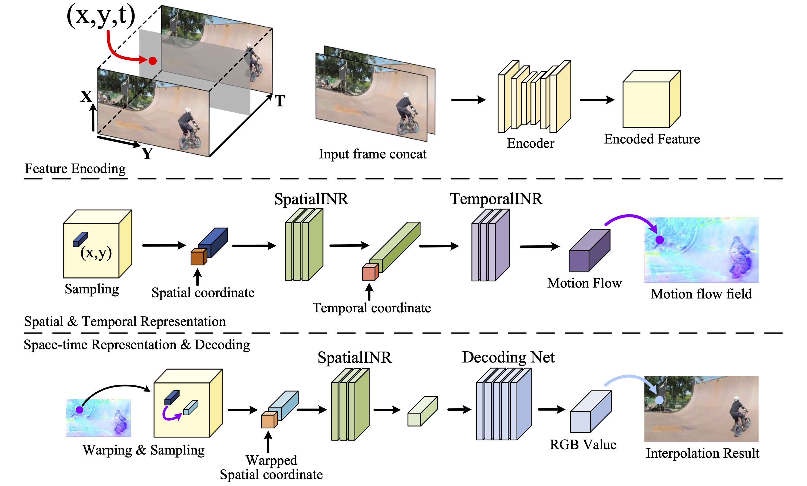

# VideoINR: Learning Video Implicit Neural Representation for Continuous Space-Time Super-Resolution

## OSS

Proposed a Spatio-Temporal VSR model which synthesize frames from encoded spatial-temporal information.

## TAGs

#CVPR #Y2022 #video_super_resolution #video_frame_interpolation

## Methods

- Continuous Spatial Representation
    - $`\mathcal{F}_s (x_s) = f_s (z^*, x_s - v^*)`$
        - $`\mathcal{F}_s(x_s)`$ : continuous feature domain defined by SpatialINR
        - $`z^*`$ : the feature vector nearest to the query coordinate $`x_s`$
        - $`v^*`$ : the spatial coordinate of the feature vector $`z^*`$
- Continuous Temporal Representation
    - $`\mathcal{M} (x_s, x_t) = f_t (x_t, \mathcal{F}_s(x_s))`$
        - $`\mathcal{M}(x_s, x_t)`$ : the continuous motion flow field
- Space-Time Continuous Representation
    - $`x_s^` = x_s + \mathcal{M} (x_s, x_t)`$
    - $`\mathcal{F}_{st} (x_s, x_t) = \mathcal{F}_s (x_s^`) = \mathcal{F}_s(x_s + \mathcal{M} (x_s, x_t))`$
    - In practice, we generate two independent flows for the motion flow field, and concatenate corresponding warped features. Intuitively, TemporalINR may implicitly learn bi-directional correspondences between the target frame and input frames, without explicit supervision.
- Feature Decoding
    - Due to the MLP-based network architecture, the RGB value of every predicted pixel depends on a single feature vector, leading to a limited size of the network receptive field, we incorporate the encoded feature as well as two input frames for decoding.
- 👨🏼‍🦲 The model tries to transform the input image sequence into features (which contain both spatial and temporal information). Then it samples pixels from positions (spatial & temporal, $`sample(x,y,t)`$ ) and decode the sampled features for each pixel.

## Resources

- [Project page](http://zeyuan-chen.com/VideoINR/)
- [ARXIV: The Paper](https://arxiv.org/abs/2206.04647)
- [CVF: The Paper](https://openaccess.thecvf.com/content/CVPR2022/papers/Chen_VideoINR_Learning_Video_Implicit_Neural_Representation_for_Continuous_Space-Time_Super-Resolution_CVPR_2022_paper.pdf)
- [YouTube: Demo video](https://youtu.be/n0J5H-F_s0k)
- [GitHub: Official implementation](https://github.com/Picsart-AI-Research/VideoINR-Continuous-Space-Time-Super-Resolution)
