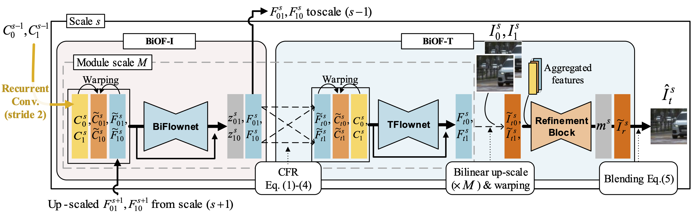
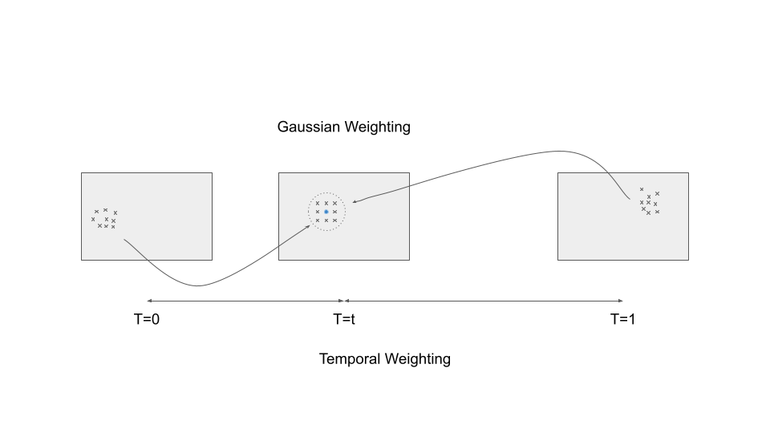
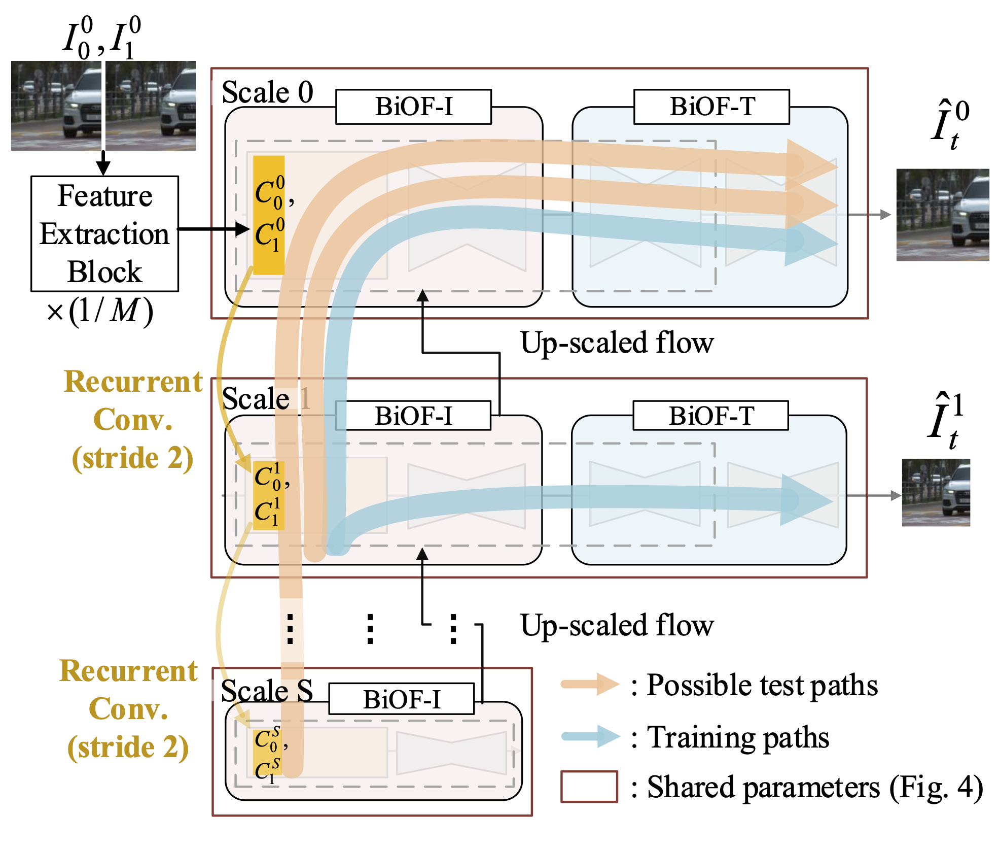

# XVFI: eXtreme Video Frame Interpolation

## OSS

Proposed a video frame interpolation network which handles different degree of motions effectively and can interpolate frames at any position between 2 input frames.

## TAGs

#ICCV #Y2021 #video_frame_interpolation

## Methods

In order to effectively capture a large motion between two input frames, the feature extraction block first reduces the spatial resolution of two input frames by a module scale factor __M__ via a strided convolution. The flow estimation in the spatially reduced size by __M__ has three advantages
    - enlarged receptive fields
    - lowered computational costs
    - smooth optical flows

### BiOF-I module

- Recurrent convolutions make a feature pyramid. Then infer optical flow recursively (finer level flows depend on coarser levels').
- The module focuses on generating good flows without considering the intermediate flows ($F_{t0}$ and $F_{t1}$).

### BiOF-T module

#### CFR (complementary flow reversal). Infer the intermediate flows by weighting summing bi-directional optical flows.

- $\tilde{F}_{t0}^x = \frac{ (1-t) \sum_{\mathcal{N}_0} w_0 \cdot (-F_{0t}^y) + t \sum_{\mathcal{N}_1} w_1 \cdot F_{1 \cdot (1-t)}^y }{ (1-t) \sum_{\mathcal{N}_0} w_0 + t \sum_{\mathcal{N}_1} w_1 }$
    - The neighborhoods of **x** are defined as:
        - $\mathcal{N}_0 = \{y | round(y + F_{0t}^y) = x\}$
        - $\mathcal{N}_1 = \{y | round(y + F_{1t}^y) = x\}$
    - 🙄 $F_{1 \cdot (1-t)}^y$ is $t F_{10}^y$

### Adjustable scalability

- The number of scales can be decided for inference, adaptive to the spatial resolution and degree of motion magnitudes for the input frames, even after once trained.
- This is architecturally very beneficial because
    - The BiOF-I module is responsible to stably capture extreme motion by recursively learning the bidirectional flows between input time instances 0 and 1 across multiple scale levels.
    - The BiOF-T module finely predicts the bidirectional flows in the original scale only from any target time __t__ to times 0 and 1 based on the stably estimated flows $F_{10}^{s=0}$ and $F_{01}^{s=0}$.
- 👨🏼‍🦲 Decide the level of feature pyramid (recurrent convolutions with stride 2) base on the largest motion we want to handle. Use multiple BiOF-I to get fine optical flow in scale 0. Then use one BiOF-T to interpolate the frame in the specific position.

## Resources

- [ARXIV: Paper](https://arxiv.org/abs/2103.16206)
- [CVF: Paper](https://openaccess.thecvf.com/content/ICCV2021/papers/Sim_XVFI_eXtreme_Video_Frame_Interpolation_ICCV_2021_paper.pdf)
- [GitHub: Official repository](https://github.com/JihyongOh/XVFI)
- [YouTube: ICCV 2021 Oral - XVFI: eXtreme Video Frame Interpolation (Demo)](https://youtu.be/5qAiffYFJh8)
- [YouTube: ICCV 2021 Oral - XVFI: eXtreme Video Frame Interpolation (Oral 12min Presentation)](https://youtu.be/igwy1TJQiRc)
