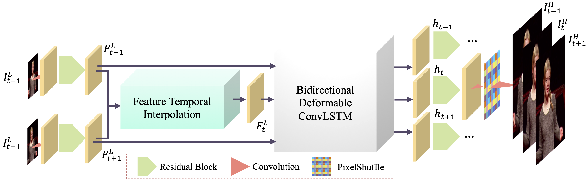
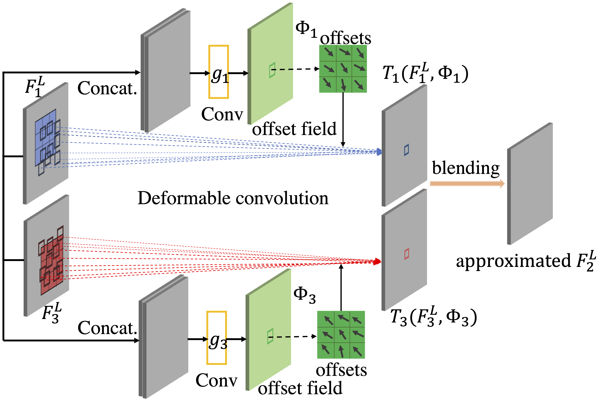
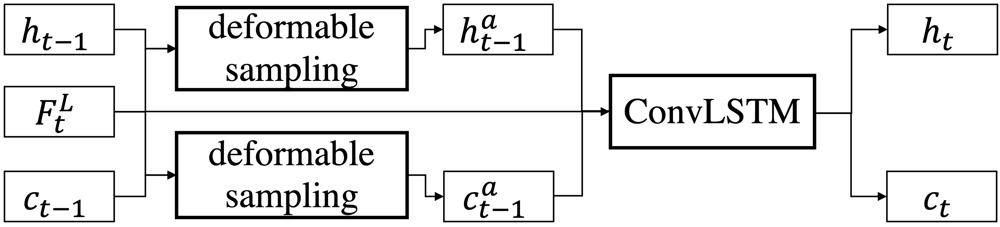

# Zooming Slow-Mo: Fast and Accurate One-Stage Space-Time Video Super-Resolution

## OSS

Proposed a Spatio-Temporal VSR model utilizing deformable convolution on spatial and temporal alignments.

## TAGs

#CVPR #Y2020 #video_super_resolution #video_frame_interpolation

## Methods

### Frame Feature Temporal Interpolation

- deformable convolution
- $`F_2^L = \alpha * T_1 (F_1^L, \Phi_1) + \beta * T_3 (F_3^L, \phi_3)'$
    - $`T_1 (F_1^L, \Phi_1) = DConv(F_1^L, \Delta p_1)`$ (deformable)
    - $`\Delta p_1 = g_1 ([F_1^L, F_3^L])`$

### Deformable ConvLSTM

- $`h_t, c_t = ConvLSTM(h_{t-1}, c_{t-1}, F_t^L)`$
    - $`\Delta p_t^h = g^h ([h_{t-1}, F_t^L])`$
    - $`\Delta p_t^c = g^c ([c_{t-1}, F_t^L])`$
    - $`h_{t-1}^a = DConv(h_{t-1}, \Delta p_h^h)`$
    - $`c_{t-1}^a = DConv(c_{t-1}, \Delta p_h^c)`$
- We feed temporally reversed feature maps into the same Deformable ConvLSTM and concatenate hidden states from forward pass and backward pass as the final hidden state $`h_t^2`$ for HR frame reconstruction.

## Resources

- [ARXIV: The Paper](https://arxiv.org/abs/2002.11616)
- [CVF: The Paprt](https://openaccess.thecvf.com/content_CVPR_2020/papers/Xiang_Zooming_Slow-Mo_Fast_and_Accurate_One-Stage_Space-Time_Video_Super-Resolution_CVPR_2020_paper.pdf)
- [GitHub: Official implementation](https://github.com/Mukosame/Zooming-Slow-Mo-CVPR-2020)
